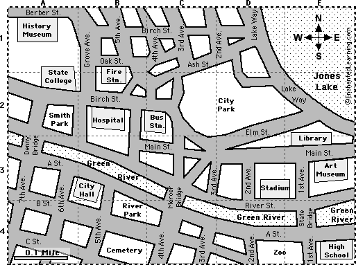

# Algoritmizace

## Přehled

1. [Úvod](#úvod)

## Úvod

1. Algoritmus:
   Algoritmus je postup, který popisuje, jak řešit určitý problém. Jedná se o abstraktní sérii kroků, které mají vést k požadovanému výstupu. Algoritmy existují i mimo svět počítačů.

2. Program:
   Program je konkrétní implementace algoritmu pomocí programovacího jazyka.

Zjednodušeně řečeno, algoritmus je jako recept, který říká, co a jak udělat, zatímco program je hotové jídlo připravené podle tohoto receptu.

Je toto definice? HLOUPOST!!! Jestli někdo bude tvrdit, že zná přesnou definici algoritmu, tak vám kecá.

### Úkol 1

Na základě tohoto [videa](https://www.youtube.com/watch?v=nUHbVRSLlEs) uveď základní vlastnosti algoritmu.

U algoritmů budeme tyto vlastnosti vždy kontrolovat.

### Úkol 2



1. Turista nemá mapu
2. Vy nemáte mapu, ale znáte cestu
3. Turista stojící u stadionu se ptá na cestu k nemocnici.

### Úkol 3

- Pochopí turista popis cesty? → srozumitelnost
- Bude vědět v každém okamžiku co má dělat? → jednoznačnost
- Dojde do cíle? → ověření, správnost
- Je to jediná možná cesta? Není jiná lepší? → efektivita

Turista je cizinec.

- Neumíme vzájemný jazyk → kompromis pochopitelný pro oba → symboly → programovací jazyk, překladače

### Úkol 4

Dostanete sadu kartiček s čísly:

1. Seřaďte karty (čísla) podle velikosti
2. Sepište stručný návod pro řazení
3. Ověřte, že se jedná o algoritmus
4. Řešte ve skupině, diskuse je důležitá.

### Úkol 5

1. Seřaďte karty podle instrukcí jiné skupiny
   > Dodržet zápis, neodhadovat, „nedomýšlet“
2. Kontrolujte, že se opravdu jedná o algoritmus
3. Najděte chybná místa
4. Navrhněte opravu

### Úkol 6

Přichází testování a ladění:

1. Do balíčku karet přidáme speciální karty
2. Je-li třeba navrhněte opravu
3. Určete povolené vstupní hodnoty

### Úkol 7

Který algoritmus je nejlepší?

Co je to nejlepší?

- Pokud chci posuzovat, musím si určit kritéria
- Žádné kritérium není apriori špatné, záleží na situaci
- Více kritérií => priorita kritérií

### Úkol 8

Vytvoř podprogram, který určí největší společný dělitel dvou čísel

### Úkol 9

Vytvoř podprogram, který dostane dva parametry `x` a `y`, který pomocí eukleidova algoritmu najde největší společná dělitel čísel `x` a `y`.

### Úkol 10

Vytvoř podprogram, který dostane jako parametr číslo a určí, jestli je dané číslo prvočíslo, nebo ne. Pomocí tohoto programu urči pro prvních `n` přirozených čísel, jestli se jedná o prvočísla.

### Úkol 11

Vytvoř podprogram `eratosthenovo_sito`, který dostane jako parametr číslo `n` a určí pro prvních `n` čísel, jestli se jedná o prvočísla.

### Úkol 12

Vytvoř podprogram, který dostane jako parametr seznam setřízených čísel a číslo `x`. Podprogram určí, jestli se číslo v seznamu nachází.

### Úkol 13

Na řešení přechozí úlohy použijte binární vyhledávání.

### Úkol 14

Časová složitost algoritmu

### Úkol 15

Vymyslete vhodný název pro následující podprogram. Jaká je časová složitost tohoto algoritmu?

```python
def ... (arr, item):
   for i in arr:
      if i == item:
         return true
   return false
```

### Úkol 16

Vymyslete vhodný název pro následující podprogram. Jaká je časová složitost tohoto algoritmu?

```python
def ... ():
   for x in range(1, 11):
      for y in range(1, 11):
         print(x*y, end=" ")
      print()
```

### Úkol 17

Určete časovou složitost následujících algoritmů:

1. Eukleidův algoritmus
2. Eratosthenovo síto
3. Binární vyhledávání

### Úkol 18

Bubble sort

### Úkol 19

Selection sort

### Úkol 20

Heap sort

### Úkol 21

Quick sort

### Úkol 22

Napište program, který změří, jak rychle jednotlivé třídicí algoritmy setřídí pole náhodných čísel. Otestujte pro různé délky pole (10, 100, 1000, 10000, 100000, 1000000, ...), Následně určete časovou složitost jednotlivých třídících algoritmů.

### Úkol 23

Rozšifrujte tento [soubor](https://drive.google.com/file/d/13ysONFxR1HhOEoC3kUxUamGUrxAN5JPb/view?usp=sharing) pomocí frekvenční analýzy. Pro analýzu jazyka použijte libovolný soubor obsahující anglický text (zašifrovaný text je v angličtině) např. tento [soubor](https://drive.google.com/file/d/1uFDzXUQa4GJtZ7eGNg95QLSdZY-2EK4Y/view?usp=drive_link).
