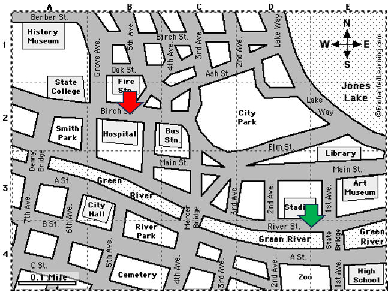

# Algoritmizace

## Přehled

1. [Úvod](#úvod)

## Úvod

1. Algoritmus:
   Algoritmus je postup, který popisuje, jak řešit určitý problém. Jedná se o abstraktní sérii kroků, které mají vést k požadovanému výstupu. Algoritmy existují i mimo svět počítačů.

2. Program:
   Program je konkrétní implementace algoritmu pomocí programovacího jazyka.

Zjednodušeně řečeno, algoritmus je jako recept, který říká, co a jak udělat, zatímco program je hotové jídlo připravené podle tohoto receptu.

Přesná definice algoritmu neexistuje. Je ale dobré vnímat rozdíl mezi algoritmem a programem.

### Úkol 1

Na základě (pseudo) definice uveď příklady nějakých algoritmů, se kterými se můžeme setkat. Jakým způsobem jsou tyto algoritmy zapsané.

### Úkol 2

Na základě tohoto [videa](https://www.youtube.com/watch?v=nUHbVRSLlEs) uveď základní vlastnosti algoritmu.

U algoritmů budeme tyto vlastnosti vždy kontrolovat.

### Úkol 3



Na obrázku je znázorněno město. Zelená šipka je místo, kde aktuálně stojíte vy a turista.

1. Turista nemá mapu
2. Vy nemáte mapu, ale znáte cestu
3. Turista stojící u stadionu se ptá na cestu k nemocnici (červená šipka).

### Úkol 4

Shrnutí vlastností:

- Pochopí turista popis cesty? → srozumitelnost
- Bude vědět v každém okamžiku co má dělat? → jednoznačnost
- Dojde do cíle? → ověření, správnost
- Je to jediná možná cesta? Není jiná lepší? → efektivita

Uveďte, co si myslíte, že je v tomto případě efektivní algoritmus?

### Úkol 5

Dostanete sadu kartiček s čísly:

1. Seřaďte karty (čísla) podle velikosti
2. Sepište stručný návod podle, kterého půjde karty seřadit
3. Ověřte, že se jedná o algoritmus (splňuje základní vlastnosti algoritmu?)
4. Algoritmus sepište ve skupině

### Úkol 6

1. Seřaďte karty podle instrukcí jiné skupiny
   > Třiďte karty přesně podle jejich algoritmu, nic nedohadujte ani nedomýšlejte
2. Kontrolujte, že se opravdu jedná o algoritmus
3. Najděte chybná či nepřesná místa
4. Navrhněte opravu

### Úkol 7

V momentě, kdy máme algoritmus hotový, přichází fáze testování a ladění:

1. Do balíčku karet přidáme speciální karty
2. Je-li třeba navrhněte opravu
3. Určete povolené vstupní hodnoty

### Úkol 8

Který algoritmus je nejlepší? Co znamená v tomto případě nejlepší?

- pokud chci posuzovat, musím si určit kritéria
- žádné kritérium není apriori špatné, záleží na situaci
- pokud mám Více kritérií, musím si určit jejich prioritu

### Úkol 9

Vytvoř podprogram, který určí největší společný dělitel dvou čísel

### Úkol 10

Vytvoř podprogram, který dostane dva parametry `x` a `y`, který pomocí eukleidova algoritmu najde největší společná dělitel čísel `x` a `y`.

### Úkol 10

Vytvoř podprogram, který dostane jako parametr číslo a určí, jestli je dané číslo prvočíslo, nebo ne. Pomocí tohoto programu urči pro prvních `n` přirozených čísel, jestli se jedná o prvočísla.

### Úkol 11

Vytvoř podprogram `eratosthenovo_sito`, který dostane jako parametr číslo `n` a určí pro prvních `n` čísel, jestli se jedná o prvočísla.

### Úkol 12

Vytvoř podprogram, který dostane jako parametr seznam setřízených čísel a číslo `x`. Podprogram určí, jestli se číslo v seznamu nachází.

### Úkol 13

Na řešení přechozí úlohy použijte binární vyhledávání.

### Úkol 14

Vymyslete vhodný název pro následující podprogram. Jaká je časová složitost tohoto algoritmu?

```python
def ... (number):
   try:
      int_number = int(number)
      return int_number ** 2
   except ValueError:
      print(f'{number} is not number')
```

### Časová složitost algoritmu

Časová složitost algoritmu je způsob, jakým vyjadřujeme, jak rychle algoritmus pracuje s _různě velkými daty_. Namísto času v sekundách měříme počet provedených _operací_, které algoritmus provádí (předpokládáme, že jedna _operace_ trvá konstantní čas).

Tato složitost se může měnit v závislosti na tom, jaká data algoritmus dostane a na základě toho rozlišujeme tři situace: _nejlepší možný scénář_, _nejhorší možný scénář_ a _průměrný případ_.

Ukažme si to na příkladu. Podprogram dostane jako parametry pole a prvek. Podprogram určí, jestli se zadaný prvek v poli nachází nebo ne. Postupně projde celý seznam prvek po prvku a když na hledaný prvek v seznamu narazí vrátí `True`:

```python
def is_element_in_array(arr, item):
   for i in arr:
      if i == item:
         return True
   return False
```

První vysvětlíme, co znamená _různě velká data_. V tomto případě se jedná o počet prvků v poli. Je asi snadno představitelné, že když bude mít pole miliardu prvků, tak program pobeží déle, než když pole bude mít deset prvků.

Nyní vysvětlíme, co jsou _operace_. Operace je něco, u čeho je potřeba něco rozhodnout/spočítat (hodně zjednodušeně řečeno). V našem případě bude operace pouze `if i == item`, jellikož je zde musíme vyhodnotit podmínku. Nyní je potřeba spočítat, kolikrát se tyto instrukce vykonají, v našem případě, kolikrát se provede příkaz `if i == item`:

- _Nejlepší případ_ - v nejlepším případě najdeme prvek hned na první pozici a program skončí. Příkaz `if i == item` se tedy vykoná pouze jednou
- _Nejhorší případ_ - v nejhorším případě najdeme prvek až na poslední pozici. Příkaz `if i == item` se tedy vykoná tolikrát, kolik prvků je v poli. Když bude v poli `n` prvků, tak říkáme, že se příkaz vykoná `n`-krát
- _Průměrný případ_ - abychom spočítali průměrný případ, museli bychom projít všechny možné scénáře. V tomto konkrétním případě by to nebylo až tak náročné. Obecně je to ale velmi složitý úkol.

> Nejlepší případ je příliš optimistický, průměrný je obecně náročné spočítat. Proto budeme vždy počítat pouze nejhorší případ.

Dobu výpočtu v nejhorším případě zapíšeme pro náš případ takto: `n`. Jedná se o počet vykonaných instrukcí pro vstupní data velikosti `n` (př. pole délky `n`) v nejhorším případě. Později ještě zavedeme tzv. asymptotickou složitost.

### Úkol 16

Vymyslete vhodný název pro následující podprogram. Jaká je časová složitost tohoto algoritmu?

```python
def ... (arr): # arr is array of integers
   x = 0
   for i in arr:
      x += i
   return x
```

### Úkol 17

Vymyslete vhodný název pro následující podprogram. Jaká je časová složitost tohoto algoritmu?

```python
def ... ():
   for x in range(1, 11):
      for y in range(1, 11):
         print(x * y, end=" ")
      print()
```

### Úkol 18

Vymyslete vhodný název pro následující podprogram. Jaká je časová složitost tohoto algoritmu?

```python
def ... (n):
   for x in range(1, n + 1):
      for y in range(1, n + 1):
         print(x*y, end=" ")
      print()
```

### Úkol 19

Určete časovou složitost následujících algoritmů:

1. Eukleidův algoritmus
2. Eratosthenovo síto
3. Binární vyhledávání

### Úkol 20

Bubble sort

### Úkol 21

Selection sort

### Úkol 22

Heap sort

### Úkol 23

Quick sort

### Úkol 24

Napište program, který změří, jak rychle jednotlivé třídicí algoritmy setřídí pole náhodně vygenerovaných čísel. Otestujte pro pole délky (10, 100, 1000, 10000, 100000, 1000000, ...). Který algoritmus třídí nejrychleji? Jaká je časová složitost jednotlivých třídicích algoritmů?

### Úkol 25

Rozšifrujte tento [soubor](https://drive.google.com/file/d/13ysONFxR1HhOEoC3kUxUamGUrxAN5JPb/view?usp=sharing) pomocí frekvenční analýzy. Pro analýzu jazyka použijte libovolný soubor obsahující anglický text (zašifrovaný text je v angličtině) např. tento [soubor](https://drive.google.com/file/d/1uFDzXUQa4GJtZ7eGNg95QLSdZY-2EK4Y/view?usp=drive_link).
