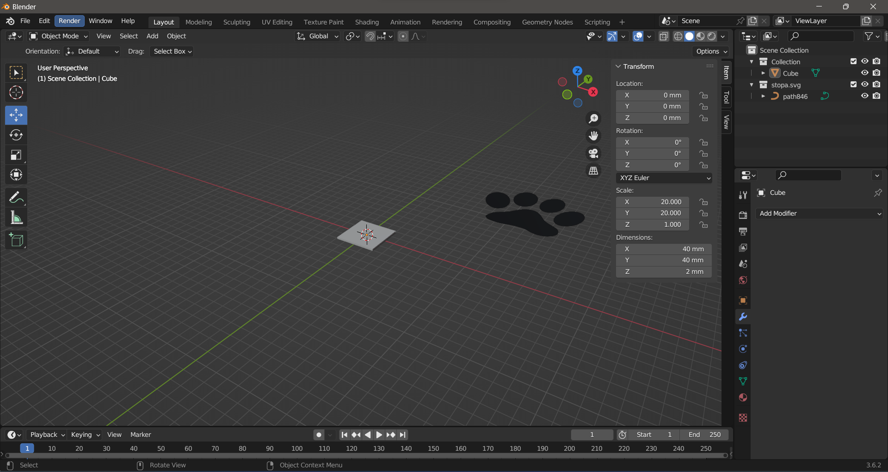

# BLENDER

## Přehled

1. [Co je Blender?](#co-je-blender)
2. [Stažení](#stažení)
3. [Základní ovládání](#základní-ovládání)
4. [Jednotky](#jednotky)
5. [Módy](#módy)
6. [Edit mód](#edit-mode)
7. [Text](#text)
8. [Modifiers](#modifiers)
9. [SVG grafika](#svg-grafika)
10. [Rotace křivky](#rotace-křivky)
11. [Export](#export)

## Co je Blender

Blender je bezplatný program pro práci s 3D grafikou, který spravuje a aktualizuje Nadace Blender. Je oblíbený jak mezi odborníky, tak začátečníky díky své rozmanitosti nástrojů. S Blenderem můžete modelovat, animovat, simulovat, vykreslovat obrazy, komponovat scény, provádět post-produkci a stříhat videa. Software také nabízí pokročilé simulace fyziky, což umožňuje vytvářet realistické zobrazení věcí jako voda či oheň. Kromě toho má Blender velkou a aktivní komunitu, která přidává nové funkce a vylepšení. Shrnutím, Blender je komplexní, ale zároveň bezplatný nástroj pro 3D grafiku.

## Stažení

Blender stáhněte z oficiálních [stránek](https://www.blender.org/)

## Základní ovládání

Po otevření aplikace uvidíte podobnou obrazovku. Z nabídky vyberte možnost **_General_.**

Zobrazí se klasická 3D scéna.

> Na obrazovce jsou na začátku vidět 3 objekty - krychle, světlo a kamera. Světlo a kameru můžeme ihned smazat (viz níže).

Ovládání je následující:

- `Zmáčknuté kolečko myši` - otáčení
- `Shift` + `zmáčknuté kolečko myši` - posun
- `kolečko myši` - přiblížení
- `klik` - výběr objektu
- `Shift` + `klik` - výběr více objektů
- `čísla` - natáčení kamery

V momentě kdy máme vybraný objekt:

- `x` - Po vybrání možnosti _Delete_ smazání objektu
- `g` - přesunutí objektu
- `r` - rotace objektu
- `s` - zvětšení objektu
- `n` - informace o objektu
- `tab` - přepnutí do [_Edit mode_](#edit-mode)

## Jednotky

Vytvaříme model pro 3D tiskárnu, v takovém případě se doporučuje mít všechny jednoty v milimetrech. Z nabídky vlevo vyberte _Scene_ a rozklikněte nabídku _Units_. Nastavte _Length_ na _Millimeters_ a _Unit Scale_ nastavte na hodnotu 0.001.

Na první pohled to vypadá, že nám zmizela mřížka. Aby se opět správně zobrazovala, vyberte možnost _Overlays_ a opět nastavte _Scale_ na hodnotu 0.001.

## Módy

Pro každý objekt, který označíme, nabízí Blender dva základní módy. Aktuálně jsme v _Object mode_. V něm lze pouze objekty přesouvat, rotovat, či měnit vělikost. Druhý je _Edit mode_, který umožňuje vybraný objekt různě tvarovat.

## Edit mode

Přepneme se nyní do _Edit modu_. Tvar objektu lze upravovat třemi způsoby:

1. vertex select
2. edge select
3. face select

Všechny tři možnosti najdeme hned vedle tlačítka pro změnu modu. Vybereme možnost _Face select_. Následně vyzkoušíme první ze tří možností pro změnu tvaru. Nejdříve klikneme na horní stěnu krychle a následně vybereme z levé lišty možnost _Insert faces_.

Objeví se žlutý kruh. Když do něj klikneme a začneme přetahovat myš směrem doprostřed vrchní stěny, tak uvidíme jak se objeví nová stěna (uvnitř vrchní stěny). Boční stěny se zároveň rozdělili na čtyři samostatné stěny.

Nyní z levé lišty vybereme možnost _Extrude region_ a označíme všechny čtyři zdi (viz [základní ovládání](#základní-ovládání)).

Kliknutím na žluté tlačítko plus, které se objevilo, a tažením směrem nahoru se zdi začnou zvyšovat.

Nyní změníme volbu na _Vertex select_. Následně vybereme z lišty vlevo možnost výběr objektů a označíme čtyři vrcholy.

Následně se v liště vlevo přepneme na možnost _Move_ a přesuneme vybrané body pomocí modré šipky níže.

Přemněme se na výběr objektů a zkusme označit všechny body. Po natočení objektu zjistíme, že body v zadní části se neoznačili. Abychom viděli všechny body najednou, můžeme v Blenderu zapnout možnost _Toggle X-Ray_.

Ukažme si ještě možnost _Bevel_, která ruší ostré hrany. Nejdříve se přepnětě na _Select edges_ (poslední ze tří možností výběru). Následně vyberte možnost _Bevel_ z levé lišty a označte všechny vnější hrany objektu.

> při zmáčknutí klávesy `alt` a následném kliknutí na jednu z hran se vybere celá hrana

Objeví se žluté kolečko, které když přetáhnete směrem nahoru, tak začnou mizet ostré hrany.

## Text

Nyní pojďme přidat na objekt nějaký text. Přepneme se zpět do _Object mode_. Z horní lišty vybereme možnost _Add_ a z nabídky vybereme _Text_. Nabídka obsahuje řadu dalších objektů, které lze přidat (v sekci _Mesh_ je i opice), my se ale zatím omezíme pouze na text.

Text si přesuneme mimo objekt. Zároveň vidíme, že se v pravém menu přidal nový objekt _Text_. Když na něj klikneme, tak objekt vybereme. Nápis budeme chtít umístit na stěnu našeho objektu, proto vyvoláme pomocí klávesy `n` vlastnosti objektu a otočíme text o 90° podle osy X.

Abychom mohli nápis změnit, musíme se přesunout do _Edit mode_. V _Edit mode_ stačí text pouze smazat pomocí delete a přepsat.

Vraťme se nyní do _Object mode_. V seznamu objektu vpravo vidíme podle ikony, že text není 3D objekt, ale pouze křivka. To změníme tak, že text označíme, v horní liště klikněme na _Object_, vybereme možnost _Convert_ a následně _Mesh_. To nám text převede na 3D objekt, už však nepůjdou měnit písmena, pouze jejich tvar.

Nyní je text stále plochý. Přesňme se proto do _Edit mode_, celý text označme a jako dříve pomocí volby _Extrude region_ text "vytáhneme" do 3D.

## Modifiers

shrnutí všech _Moidifiers_ [zde](https://www.youtube.com/watch?v=idcFMhoSdIc)

Nyní bychom chtěli objekt a 3D text sjednotit do jednoho objektu. Vraťme se do _Object mode_, zmenšeme text a přesuňme ho tak, aby byl uvnitř objektu a částečně z něj vyčuhoval. Klikneme na objekt a z pravé lišty následně vybereme možnost _Modifiers_.

Klikneme na _Add modifier_ a vybereme možnost _Boolean_.

My chceme objekt a text sjednotit, proto vybereme možnost _Union_. Následně klikneme na kapátko a kapátkem klikneme na text.

Poté již stačí rozbalit nabídku a vybrat možnost _Apply_.

V momentě, kdy jsme aplikovali _Modifier_ a došlo k sjednocení, můžeme ze seznamu objektů smazat text.

Nyní zkusíme do objektu ještě vyříznout díru. Přes možnost _Add_ v horním menu vložíme ze sekce _Mesh_ válec (_Cylinder_).

Upravíme rozměry válce aby se díra nebyla příliš velká a válec protáhneme.

Nyní vybereme původní objekt (protože z něj chceme něco odstranit), vybereme možnost _Modifiers_ → _Add modifier_ → _Boolean_. Tentorkát naší volbou není _Union_ ale _Difference_. Kapátkem označíme válec a zvolíme _Apply_.

Nyní již můžeme odstranit válec (po odečtení válec nezmizí). V původním objektu nám zůstane po válci díra.

## SVG grafika

Nyní si ukážeme, jak lze udělat v Blenderu z `.svg` souboru objekt.

V programu pro tvorbu vektorové grafiky (př. inkscape) vytvoříme libovolný obrázek, který následně uložíme jako `.svg` soubor. Před uložením doporučuji sjednotit všechny části do jedné.

> Poznámka: vytvořil jsem si nový projekt, provedl všechna zmíněná nastavení a krychli jsem nastavil rozměry 40x40x2mm.

V momentě, kdy máme `.svg` soubor uložený v počítači, vybereme z horního menu možnost _File_ → _Import_ → _Scalable Vector Graphics (.svg)_ a z počítače vybereme náš `.svg` soubor.

Obrázek bude pravděpodobně příliš velký. Rozměry jde nastavit již v inkscape, stejně dobře to však lze udělat i v blenderu. Pro snadnější manipulaci ještě doporučuji kliknout pravým tlačítkem myši na obrázek a vybrat možnost _Set Origin_ → _Geometry To Origin_.

Nyní akorát zbývá již obrázek převést na 3D. Klikneme na stopu, přejdeme do nabídky _Modifiers_ a vybereme možnost _Solidify_. Nastavíme _Thickness_ na 3mm a _Offset_ na 0.

Pokud chcete s obrázkem dále pracovat jako s objektem, stačí ho obdobně jako dříve text převést na _Mesh_.

## Rotace křivky

## Nůž

https://www.youtube.com/watch?v=0I-4a1q0YLE

## Strom

https://www.youtube.com/watch?v=V0LyhVM6ILk

## ChatGPT a Blender

https://www.youtube.com/watch?v=x60zHw_z4NM

## Export

https://www.youtube.com/watch?v=0IPILHZGvsg

Když je váš 3D model připraven na tisk, stačí z horní lišty vybrat _File_, poté _Export_ a vybrat formát `.xtl`.

