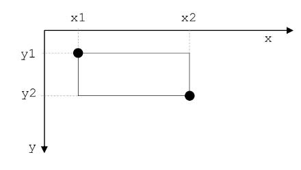
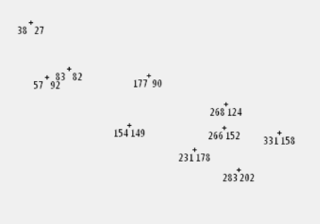
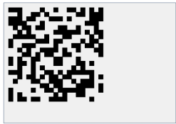

# PYTHON

## Přehled

1. [Co je Python?](#html)
2. [VS code](#vs-code)
3. [Virtuální prostředí](#virtuální-prostředí)
4. [Výpisy](#komentář)
5. [Řídící struktury](#nadpis)
6. [Funkce](#odstavec)
7. [Pole](#kontejner)
8. [Proměnná](#zalomení-řádku)
9. [OOP](#třídy-a-id)
10. [Dědičnost](#kontejner)
11. [Práce se soubory](#kontejner)
12. [Složitost](#kontejner)
13. [Moduly](#kontejner)
14. [Výjimky](#kontejner)
15. [Vstup/výstup](#kontejner)
16. [Třídící algoritmy](#kontejner)

## Co je Python?

Python je populární programovací jazyk, který vytvořil Guido van Rossum v roce 1991.

Kde se Používá?

- vývoj webových stránek (server-side)
- vývoj softwaru
- datovou analýzu a vizualizaci
- matematické výpočty
- systémové skriptování

Proč právě Python?

- multiplatformní (Windows, Mac, Linux, Raspberry Pi atd.)
- jednoduchá syntaxe
- kratší programy oproti ostatním jazykům
- lze pracovat procedurálním způsobem, objektově orientovaným způsobem nebo funkcionálním způsobem.

Abychom mohli psát programy v pythonu, je potřeba nainstalovat interpreter pro python. Instalační balíček stáhněte [zde](https://www.python.org/downloads/).

## VS code

programy budeme psát ve Visual Studiu Code (VS code). VS code je potřeba nainstalovat nainstalovat do počítače z [oficiálních stránek](https://code.visualstudio.com/).

V momentě kdy máte nainstalované VS code, je potřeba nainstalovat ještě rozšíření ve VS code. V sekci `extension` vyhledejte `python` a vyberte první možnost (viz obrázek):


Program lze spustit bud pomocí `ctrl+F5` nebo tlačítkem `run python file` v pravém horním rohu.

## Virtuální prostředí

projekty tvoříme ve [virtuálním prostředí](https://code.visualstudio.com/docs/python/environments).

k čemu to je?

Jak vytvořit virtuální prostředí (virtual enviroment - venv)?

1. otevřete paletu příkazů (Ctrl+Shift+P)
2. vyhledejte položku `Python: Create Environment` a vyberte ji
3. objeví se dvě možnosti `Venv` or `Conda`.
4. vybereme možnost `Venv`
5. vybereme požadovaný interpretr

## Výpisy

### Úloha 1

Zkusme napsat první program:

```python
print(1 + 2 + 3)
```

`print` je [funkce](#podprogramy) (funkcím se budeme věnovat později). To, co napíšeme do závorek se vypíše do konzole.

### Úloha 2

Python dokáže fungovat jako kalkulačka. Jaké budou výsledky následujících výrazů?

```python
print(123)
print(42 - 17)
print(3 + 4 * 5)
print((3 + 4) * 5)
print(132 / 11)
print(1 + 2 * 3 / (5 – 1))
```

### Úloha 3

Pozor, zápisy musí být správně, jinak se objeví chyba. Co se
stane, pokud zadáš následující příkazy?

```python
print(22 + 7 *)
print(19 - (3 4))
```

### Úloha 4

Někdy se však i po správném zápise může objevit chybové hlášení. Co se stane, pokud zadáš následující příkaz?

```python
print(10 / (6 – 2 * 3))
```

### Úloha 5

Petrovi bylo přesně před dvěma měsíci 16 let. Využij Python jako kalkulačku a spočítej:

1. Kolik je mu nyní přibližně dní?
2. Kolik je to hodin?
3. Kolik je to sekund?

Předpokládej, že rok má 365 dní a měsíc má 30 dní.

### Úloha 6

Zjisti, která číslice se vyskytuje nejčastěji ve výsledku výrazu:
$123456789 * 111111111111111111111$

### Úloha 7

Výpočet $2 * 2 * 2 * 2 * 2 * 2 * 2 * 2 * 2 * 2$ je umocnění $2^{10}$. V Pythonu se umocnění zapisuje jako `2 ** 10`.

- Tipni si, kolik číslic bude mít $2^{30}$.
- Vypočítej pomocí pythonu a ručně spočítej počet číslic ve výsledku.

## Proměnná

V matematice je zvykem označovat hodnoty písmeny, například délka strany čtverce $a = 100$ nebo poloměr kruhu $r=4$. To samé můžeš udělat i v Pythonu.

### Úloha 1

Zkus napsat následující program:

```python
a = 100
```

Nic se nestalo (to je správně!). Python si vytvořil _proměnnou_ s _názvem_ `a` a přitom si zapamatoval, že má _hodnotu_ 100.

Lze si to představit jako krabičku. Text na krabičce je _název_ proměnné, zatímco to, co dáme dovnitř krabičky je _hodnota_ proměnné:


### Úloha 2

Zkusme nyní vypsat proměnnou `a`:

```python
a = 100
print(a)
```

Vypíše se hodnota uložená v proměnné.

### Úloha 3

Vyzkoušej vytvořit a nastavit i jiné proměnné:

```python
vyska = 167
cena = 22 + 7
```

Zkontroluj, jaké hodnoty se do proměnných uložily.

Proměnných můžeme vytvořit, kolik budeme chtít a později je používat v dalších výpočtech.

### Úloha 3

Definujme tři proměnné:

```python
a = 100
vyska = 167
cena = 29
```

Co se stane, když bychom chtěli vypsat proměnnou `vek`, kterou jsme zatím nedefinovali?

```python
print(vek)
```

### Úloha 4

Proměnné můžeš použít i v matematických zápisech a Python namísto názvu proměnné dosadí její hodnotu. Mějme proměnné `a`, `vyska` a `cena` ze cvičení 3. Urči výsledek následujících příkazů:

```python
print(190 - vyska)
print(3 * cena + 10)
print(cena + vyska)
```

### Úloha 5

Proměnným můžeme změnit jejich obsah – vyzkoušej:

```python
cena = 29
cena = 6 * 7
print(cena)
```

### Úloha 5

Změň hodnotu proměnné vyska tak, aby v ní byla tvoje výška v centimetrech.

### Úloha 5

Přiřaď do proměnné `zmrzlina` cenu jedné zmrzliny (například 25 korun). Do proměnné `pocet` přiraď počet kamarádů, kterým chceš koupit po jedné zmrzlině. Za
použití proměnných sestav přiřazovací příkaz, pomocí kterého se do třetí proměnné `zaplatit` přiřadí celková cena, kterou zaplatíš.

### Úloha 6

V matematice značíme obsah kruhu $S$ a počítáme jej podle vzorce $\pi  r^2$. Obvod kruhu značíme $O$ a počítáme jej podle vzorce $2 \pi  r$. Vytvoř proměnné pro `poloměr`, `obsah` i `obvod` kruhu a přiřaď do nich správné výrazy. Vytvoř si proměnnou `pi` s hodnotou $3.14$.

### Úloha 7

Vyzkoušej, které z následujících názvu lze použít jako název proměnné:

- kuk
- Ahoj!
- 1.A
- prvni_trida
- cerno-bile
- OK
- o0o0o0o
- asdf
- věk
- počet osob
- trida(3)

## Vypisování

### Úloha 1

Příkaz `print` již známe. Vyzkoušej, co vypíše následující program:

```python
print('Ahoj, já jsem počítač')
```

Příkaz `print` slouží na vypisování textů. Text, který se má vypsat, napíšeš mezi apostrofy.

### Úloha 2

Zjisti, co Python vypíše v případě následujících příkazů:

```python
print(1 + 2 * 3)
print('1 + 2 * 3')
print()
```

### Úloha 3

Příkaz `print` umí vypsat víc věcí – vyzkoušej následující příkazy. Co způsobí čárka v jednotlivých příkazech?

```python
print('Mám rád', 'kapustu')
print('Moje oblíbené číslo je', 42)
print('Do školy jsem šel', 2 * 10, 'minut')
```

### Úloha 4

V příkazu `print` lze kombinovat i proměnné. Zkus, co vypíše následující program:

```python
vek = 16
print('Je mi', vek, 'let')
```

### Úloha 5

Rozšiř program z úlohy 4 tak, aby navíc vypsal zprávu: _Příští rok mi bude 17 let_.

### Úloha 6

Představ si, že program z úlohy 5 spustí tvůj otec. Vyzkoušej program za něj – dosaď do proměnné věk jeho skutečný věk. Zobrazí se správný výsledek i na druhém řádku svého výstupu? Jestli ne, program oprav.

### Úloha 7

Vytvoř nový program. Na začátku přiřaď do proměnně `penize`, kolik korun máš. Do proměnné `platba` přiřaď cenu nákupu. Použij proměnné a vypiš pomocí nich:

```
Mám ... korun
Platím ... korun
Zbyde mi ... korun
```

### Úloha 8

Hřiště má šířku 50 metrů a délku 80 metrů. Budeš běhat po obvodě. Vytvoř program, který vypíše, kolik metrů uběhneš po
7 kolech. Do proměnné `sirka` přiřaď hodnotu 50, do proměnné
`delka` hodnotu 80 a do proměnné `pocet_kol` hodnotu 7. Vypiš text:

```
Šířka hřiště je 50 metrů, délka je 80 metrů
Jedno kolo okolo hřiště je 260 metrů
Po 7 kolech uběhneš 1820 metrů
```

Předpokládejme nyní, že šířka je 45 metrů a délka 70 metrů. Přepiš hodnoty v proměnných. Zobrazí program správné
hodnoty na druhém a na třetím řádku výstupu? Jestli ne, program oprav.

### Úloha 9

Obchod nabízí 20% slevu. Původní cena výrobku byla 199 korun. Napiš program, který vypočítá, kolik zaplatíš. V programu
použij proměnné `puvodni_cena`, `sleva`, `cena_po_sleve` a pomocí nich vypiš:

```
Cena alba je 199 korun
Sleva činí 20 procent
Zaplatíš 159.2 korun
```

Jakou výslednou cenu program vypíše pro výrobek, jehož původní cena byla 399 korun, jestliže sleva činí 30 %?

## Kreslení

Doposud programy počítaly a vypisovaly textové zprávy. Nyní zkusíme kreslit obrázky. Postupuj takto:

1. Vytvoř následující program:

```python
import tkinter
canvas = tkinter.Canvas()
canvas.pack()
```

2. Program spusť – na obrazovce uvidíš nové okno.
3. Zjisti, zda se dá okno posouvat, měnit jeho velikost. Nakonec toto nové okno zavři.
   program vyrobil grafickou plochu `canvas`.

### Úkol 1

Přidej do programu nový příkaz:

```python
import tkinter
canvas = tkinter.Canvas()
canvas.pack()
canvas.create_rectangle(50, 70, 220, 150)
```

příkaz vykreslí obdelník.

### Úkol 2

V závorkách příkazu `canvas.create_rectangle( , , , )` jsou 4 čísla. Zkus je postupně měnit. Program pokaždé spusť, abys viděl, co nakreslí:

```python
canvas.create_rectangle(0, 0, 220, 150)
canvas.create_rectangle(0, 0, 50, 50)
canvas.create_rectangle(0, 0, 250, 50)
canvas.create_rectangle(20, 10, 250, 50)
canvas.create_rectangle(20, 10, 50, 250)
```

### Jak fungují souřadnice v tkinteru

Souřadnice fungují v tkinter trochu netradičně:


V matematice jsme zvyklí, že střed je "uprostřed". Zde ale leží bod se souřadnicemi $[0, 0]$ v levém horním rohu. Osa $x$ jde zleva doprava. Osa $y$ jde shora dolů (čím větší číslo, tím níže).

V příkazu `canvas.create_rectangle(x1, y1, x2, y2)` píšeme do závorek souřadnice protilehlých vrcholů obdélníku:


Tyto souřadnice vrcholů bychom mohli znázornit na souřadnicových osách následujícím způsobem:



### Úkol 3

Nakresli obdélník, který má souřadnice
protilehlých vrcholů $[50, 30]$ a $[300, 200]$.

### Úkol 4

Nakresli obdélník, který má jeden vrchol na souřadnicích $[200, 100]$, jeho šířka je 60 a výška 140.

### Úkol 5

Nakresli dva čtverce se stranami délky 80 (pozici čtverců zvol podle uvážení):


### Úkol 6

Nakresli dva velké čtverce – jeden se stranou
délky 100 a druhý 150. Čtverce budou mít společný střed jako na následujícím obrázku:


### Úkol 7

Nakresli ze tří obdélníků o rozměrech 150x50, 100x50
a 50x50 následující pyramidu:


### Úkol 8\*

Vytvoř z pěti čtverců následující ornament.
Rozměry čtverců zvol podle svého uvážení (všechny menší čtverce budou stejně velké):


### Úkol 9

Obdélník lze i vybarvit:

```python
import tkinter
canvas = tkinter.Canvas()
canvas.pack()
canvas.create_rectangle(30, 30, 130, 130, fill='red')
```

### Úkol 10

Přidej do programu z úkolu 9 další 3 příkazy na kreslení obdélníků, abys dostal následující obrázek:


Další barvy získáš, když místo slova `red` napíšeš `green`, `blue` nebo `yellow`.

### Úkol 11

Vytvoř program, který nakreslí nizozemskou vlajku:


### Úkol 12

Vytvoř program, který nakreslí irskou vlajku s barvou `orange`:


### Úkol 13

Následující obrázek vznikl ze čtyř čtverců. První z nich má souřadnice levého horního vrcholu $[50, 50]$. Napiš program, který nakreslí následující obrázek (zvol libovolné barvy):


### Úkol 14\*

Vytvoř program, který vykreslí norskou vlajku:


### Úkol 15\*

Vytvoř nový program, ve kterém uprav následující kód tak, aby
nakreslil stejný obrázek, ale aby program obsahoval jen 3 příkazy pro kreslení obdélníků:

```python
canvas.create_rectangle(90, 90, 150, 150, fill='yellow')
canvas.create_rectangle(150, 90, 210, 150, fill='red')
canvas.create_rectangle(90, 150, 150, 210, fill='green')
canvas.create_rectangle(30, 90, 90, 150, fill='red')
canvas.create_rectangle(90, 30, 150, 90, fill='green')
```

### Úkol 16

Opiš do něj kód uvedený níže. V proměnných `x`, `y` jsou uložené souřadnice levého horního rohu čtverce. Dokonči kód programu tak, abys pomocí uvedených proměnných nakreslil čtverec se stranou délky
100:

```python
import tkinter
canvas = tkinter.Canvas()
canvas.pack()
x = 100
y = 70
canvas.create_rectangle(x, y, x + , , fill='yellow')
```

### Úkol 17

Vytvoř program, který použije čtyři proměnné `x`, `y`, `sirka`, `vyska` a na jejich základě nakreslí obdélník s levým horním rohem na
souřadnicích `x`, `y`, danou šířkou a výškou. Barvu si zvol podle svého.

### Úkol 18

Vytvoř program, který nakreslí následující čtverce:


Tyto čtverce mají společný levý horní roh, jehož souřadnice jsou v proměnných `x`, `y`. Čtverce se postupně zmenšují tak, že červený má délku strany 100, modrý 70 a tmavomodrý 40.

### Úkol 19

Vytvoř program, který nakreslí tři vzájemně se dotýkající obdélníky:


Souřadnice levého horního rohu prvního obdélníku jsou uložené v proměnných `x`, `y`. Všechny tři obdélníky mají stejnou šířku a výšku – tyto rozměry jsou uložené v proměnných `a`, `b`.

Bude program fungovat správně i v případě, že hodnotu proměnné `a` zvětšíš o 20 a hodnotu proměnné `y` zvětšíš o 10? Jestli ne, program oprav.

### Úkol 20

Pět barevných čtverců leží těsně vedle sebe na jedné podložce. Velikosti stran jsou postupně 100, 80, 60, 40, 20. Souřadnice levého dolního rohu prvního čtverce jsou v proměnných `x`, `y`. Napiš program, který vykreslí tyto čtverce:


## Podprogramy

Doposud jsme psali jen takové příkazy, které počítač znal (`print`, `create_rectangle`, `Canvas`). Nyní budeme vytvářet své vlastní příkazy – tzv. podprogramy (též funkce).

### Úkol 1

Jak vytvořit vlastní podprogram?

1. Opiš následující kód:

```python
def vypis_text():
    print('************')
    print('** Python **')
    print('************')
```

2. Program spusť – pokud se nic nestalo, je to v pořádku.
3. Vlož ještě příkaz `vypis_text()`:

```python
def vypis_text():
    print('************')
    print('** Python **')
    print('************')

vypis_text()
```

4. Pokud nyní program spustíš, vypíše se text.

Slovem `def` začíná definice tvého nového příkazu – podprogramu. `vypiš_text` je název podprogramu (podobně jako `print` je název pro podprogram, který vypisuje text). Tři příkazy `print` se nazvývají tělo programu.

Po spuštění programu se počítač naučil nový příkaz `vypis_text`. Počítač ho zatím
nevykonal, jen se ho naučil. Skupinu příkazů `print` – tedy tělo podprogramu `vypis_text` – počítač vykoná až tehdy, když narazí na příkaz `vypis_text()`. Takovýto zápis se nazývá volání podprogramu.

### Úkol 2

Přidej do programu další příkazy – pozor, tyto příkazy nesmí mít odsazení, protože už nepatří do podprogramu:

```python
def vypis_text():
    print('************')
    print('** Python **')
    print('************')

print('Vítej!')
vypis_text()
print()
vypis_text()
print('to je konec')
```

V tomto programu se nejdříve definoval podprogram `vypis_text`. Za ním následují příkazy `print` a příkazy pro volání podprogramu `vypis_text`. Python zobrazil svoji
vizitku dvakrát, protože v programu jsou dvě volání podprogramu `vypis_text`. Podprogram tedy můžeme volat i vícekrát.

### Úkol 3

Změň předchozí program tak, aby počítač vypsal:

```
Hello!
*****************
** I am Python **
*****************
How are you?
*****************
** I am Python **
*****************
I am fine.
*****************
** I am Python **
*****************
The end
```

### Úkol 4

Vytvoř nový program, který bude obsahovat následující kód:

```python
refren()
refren()
print()
print('když já jím dám ovsa')
print('oni skáčou hopsa')
print()
refren()
refren()
def refren():
print('já mám koně vraný koně')
print('to jsou koně mí')
```

Když program spustíš, Python vypíše chybové hlášení. Python tím říká, že na 1. řádku programu není možné volat podprogram `refren`, protože tento podprogram ještě nebyl definován. Uprav program tak, aby se úryvek písně vypsal správně.

### Úkol 5

Ve svém programu můžeš definovat i více podprogramů. Vytvoř nový program a definuj v něm tři podprogramy. Každý z nich zobrazí jeden z následujících obrázků:

- podprogram noha nakreslí takovouto nohu (dole jsou dvě podtržítka vlevo i vpravo):

```
  |
__|__
```

- podprogram obdelnik nakreslí takovýto obdélník:

```
#####
#   #
#####
```

- podprogram trojúhelník nakreslí takovýto trojúhelník:

```
  *
 ***
*****
```

Potom zkus pomocí vytvořených podprogramů zobrazit následující obrázky:

```
  *
 ***
*****
  *
 ***
*****
  |
__|__
```

```
  *
 ***
*****
#####
#   #
#####
  |
__|__
```

```
#####
#   #
#####
  |
__|__
#####
#   #
#####
```

```
toto je noha:
  |
__|__
toto je obdélník:
#####
#   #
#####
toto je trojúhelník:
  *
 ***
*****
```

### Úkol 6

Vytvoř nový program a vyzkoušej následující kód:

```python
import tkinter
canvas = tkinter.Canvas()
canvas.pack()
def kresli():
    canvas.create_rectangle(10, 20, 30, 40, fill='red')
kresli()
```

### Úkol 7

Vytvoř nový program a v něm definuj podprogram `kriz`, který po zavolání nakreslí červený kříž:


### Úkol 8\*

Vytvoř nový program, který bude schopen nakreslit robota. V programu budou čtyři podprogramy – `hlava`, `ruce`, `nohy`, `telo` – a každý z nich bude schopen
nakreslit část robota. Když je zavoláš v následujícím pořadí:

```python
hlava()
ruce()
nohy()
telo()
```

nakreslí se celý robot jako na obrázku:


## Náhoda

### Úkol 1

Zkus spustit následující program:

```python
import random
print(random.randint(1, 6))
```

Program vypíše náhodné číslo od 1 do 6.

### Úkol 2

Náhodné číslo si můžeš zapamatovat – napiš program s následujícím kódem a spusť jej (i vícekrát):

```python
import random
n = random.randint(1, 6)
print('Na kostce padla', n)
```

### Úkol 3

Uprav program z úkolu 2 – vytvoř podprogram `hod_kostkou` a doplň kód programu tak, aby se simulovalo deset hodů za sebou:

```python
import random
def hod_kostkou():
    n = random.randint(1, 6)
    print('Na kostce padla', n)
hod_kostkou()
```

### Úkol 4

Uprav program z úkolu 3, aby počítač simuloval jeden hod na dvacetistěnné kostce.

### Úkol 5\*

Máme _sudou_ hrací kostku, která má na stěnách čísla 2, 4, 6, 8, 10, 12. Uprav program z úkolu 3, aby simuloval hod takovou kostkou.

### Úkol 6\*

Máme _lichou_ hrací kostku, která má na stěnách čísla 1, 3, 5, 7, 9, 11. Uprav předchozí program, aby simuloval hod takovou kostkou.

### Úkol 7\*

Máme _exotickou_ hrací kostku, která má na stěnách čísla 1, 4, 9, 16, 25, 36. Uprav předchozí program, aby simuloval hod takovou kostkou.

### Úkol 8

Vytvoř program, který vygeneruje náhodný PIN pro tvůj mobil. Do čtyř proměnných `a`, `b`, `c`, `d` přiřaď náhodná čísla od 0 po 9 a potom je jediným příkazem
`print` vypiš. Výpis může vypadat například takto:

```
Tvůj nový PIN je 1 3 7 3
```

### Úkol 9

Vytvoř nový program – generátor náhodných dat (pro jednoduchost nechť má každý měsíc 30 dní). Po spuštění program vypíše informaci s vygenerovaným náhodným datem, například:

```
Pokoj si uklidím 30 . 2 . 2025
```

### Úkol 10

Vytvoř nový program, ve kterém pomocí následujícího kódu
nakreslíš náhodně umístěný čtverec:

```python
import tkinter
import random
canvas = tkinter.Canvas()
canvas.pack()
def nahodny_ctverec():
    x = random.randint(10, 300)
    y = random.randint(10, 200)
    canvas.create_rectangle(x, y, x + 50, y + 50,fill='orange')
nahodny_ctverec()
```

### Úkol 11

Doplň do předchozího programu příkazy tak, aby program nakreslil pět náhodných čtverců.

### Úkol 12

Uprav předchozí program tak, aby se čtverce kreslily nejen na náhodných pozicích, ale také aby měl každý čtverec náhodnou velikost z intervalu od 10 do 100.

## Kreslení textu

### Úkol 1

Pro psaní textů do grafické plochy lze použít následující příkaz:

```python
import tkinter
canvas = tkinter.Canvas()
canvas.pack()
canvas.create_text(150, 50, text='posílám pozdrav z grafické plochy')
```

### Úkol 2

Vytvoř program a napiš do něj příkazy, kterými pojmenuješ
okraje grafické plochy jako na následujícím obrázku (souřadnice odhadni):


### Úkol 3

Vytvoř program, ve kterém vytvoř podprogram `nahodne_cislo`, který na náhodnou pozici v grafické ploše vypíše náhodné šesticiferné číslo, tedy číslo z intervalu od 100000 do 999999.

## Opakování

### Úkol 1

Zaznamenáváme naši GPS pozici. Vytvoř program a v něm podprogram `gps`, který vygeneruje náhodné souřadnice `x`, `y` představující GPS pozici. Na tomto místě nakreslí značku `+` a pod ni vypíše danou pozici – čísla x, y. Po
deseti zavoláních podprogramu `gps` můžeš dostat například takovýto výsledek:



### Úkol 2

Vytvoř program bez grafické plochy, který pomocí příkazu `print` vypíše text _Těším se na prázdniny_ pětkrát pod sebe.

### Úkol 3

V obou předchozích programech jsi měl vícekrát nakopírované příkazy `gps()` nebo `print()`. Abys je nemusel opakovaně kopírovat, můžeš to zapsat jednodušeji. Uprav kód programu z úkolu 2 následovně:

```python
for i in range(5):
    print('Těším se na prázdniny')
```

Zkus místo čísla 5 dát číslo 10 a program znovu spusť. Urči, co je tímto číslem ovlivňováno.

### Úkol 4

Uprav program stejně, jako je uvedeno níže, a spusť jej:

```python
for i in range(5):
    print('Těším se na prázdniny')
    print('=====================')
```

Slovem `for` začíná příkaz cyklu. Pětka v závorce udává počet zopakování. Dva příkazy `print` tvoří tělo cyklu (tělo známe již z podprogramů). Příkazy v těle cyklu se vykonají 5x.

### Úkol 5

Je důležité odsadit od kraje příkazy, které tvoří tělo cyklu. Vyzkoušej, co vypíše takto upravený program:

```python
for i in range(5):
    print('Těším se na prázdniny')
    print('=====================')
```

### Úkol 6

Uprav program z úkolu 1, a opakované volání podprogramu `gps()` zapiš pomocí `for` cyklu.

### Úkol 7

Vytvoř nový program a v něm podprogram `cerveny_ctverec()`. Ten nakreslí na grafickou plochu na náhodné souřadnice červený čtverec se stranou délky 10. Použij `for` cyklus na to, abys nakreslil 2000 červených čtverců.

### Úkol 8

Doplň do předchozího programu podprogram `modry_ctverec()`. Tento podprogram bude kreslit na náhodné souřadnice modrý čtverec se stranou délky 10. Zajisti, aby tělo cyklu obsahovalo volání podprogramu `cerveny_ctverec()` i podprogramu `modry_ctverec()`. Výsledek může vypadat
například jako na následujícím obrázku:


### Úkol 9

Vytvoř nový program, který nakreslí hvězdnou
oblohu:


Návod:

- Napiš podprogram hvězdička, který nakreslí na náhodnou pozici malý žlutý čtvereček. Velikost jeho strany bude náhodné číslo z rozsahu od 2 do 4.
- Tmavomodrou oblohu nakresli jako velký obdélník s barvou _navy_.
- Potom zavolej tisíckrát podprogram hvezdicka.

### Úkol 10

Napiš program, který simuluje hody dvěma kostkami. Zapiš pomocí `for` cyklu pět hodů, kdy se v těle cyklu do dvou proměnných přiřadí dvě náhodná čísla, ta se vypíšou a vypíše se i jejich součet. Výpis může vypadat například takto:

```
Na první kostce padlo číslo 4
Na druhé kostce padlo číslo 3
Součet obou čísel je 7

Na první kostce padlo číslo 2
Na druhé kostce padlo číslo 4
Součet obou čísel je 6

Na první kostce padlo číslo 5
Na druhé kostce padlo číslo 2
Součet obou čísel je 7

Na první kostce padlo číslo 3
Na druhé kostce padlo číslo 1
Součet obou čísel je 4

Na první kostce padlo číslo 1
Na druhé kostce padlo číslo 4
Součet obou čísel je 5
```

### Úkol 11

Vytvoř nový program, který bude představovat generátor náhodného QR kódu a který bude schopen generovat podobný QR kód jako na obrázku níže:



Obrázek se skládá z velkého počtu černých čtverečků. Každý má délku strany 10 a je nakreslený v jednom náhodně vybraném políčku mřížky, která obsahuje 21x21 políček.

### Úkol 12

Vytvoř program a pomocí následujícího kódu vypiš celá čísla od 0 do 9:

```python
for i in range(10):
    print('číslo', i)
```

Jak to funguje? `i` je proměnná, do které příkaz `for` postupně přiřazuje celá čísla od 0 do 9.

### Úkol 13

Urči, co je potřeba v předchozím programu změnit, aby se vypsala čísla:

1. 0, 1, ... 10 – tedy i číslo 10
2. 1, 2, ... 10
3. 2, 4, ... 20
4. 10, 20, ... 100

### Úkol 14

Vytvoř program, který pomocí `for` cyklu vypíše čísla a jejich druhé mocniny:

```
0 na druhou je 0
1 na druhou je 1
2 na druhou je 4
3 na druhou je 9
4 na druhou je 16
5 na druhou je 25
6 na druhou je 36
```

### Úkol 15

Vytvoř program a v něm pomocí cyklu nakresli devět čtverců
s délkou strany 30. Mezi čtverci bude mezera o velikosti 10. Použij proměnnou `x`, ve které bude uložena x-ová souřadnice levého horního rohu kresleného čtverce. Hodnota této
proměnné bude v cyklu zvýšena pokaždé o 40.


### Úkol 16

Zlatokop našel poklad – 10 zlatých krychliček různých velikostí. Ty postupně ukládal na stůl těsně vedle sebe. Vytvoř program, který takový poklad nakreslí. Každá zlatá krychlička má náhodně zvolenou velikost z rozsahu od 10 do 40. Použij proměnnou, do které budeš ukládat náhodné číslo pro velikost krychličky. Kromě ní použij další proměnnou, pomocí níž budeš evidovat x-ovou pozici krychličky.


### Úkol 17

Vylepši předchozí program tak, aby byly mezi zlatými krychličkami mezery o velikosti 5.


### Úkol 18

Existuje pověst o králi, který slíbil mudrcovi za odměnu tolik zrnek pšenice, kolik jich bude na všech políčkách šachovnice? Král mudrcovi dovolil, aby na první políčko dal 10 zrnek, na druhé 20, na třetí 30 atd. Kolik by mudrc dostal zrnek rýže? Políček na šachovnici je 64.

## Větvení

### Úkol 1

Počítač dokáže porovnávat dvě hodnoty (čísla):

```python
print(1 < 2)    # program vypíš true
print(4 < 2)    # program vypíš false
print(4 < 2 + 1)    # program vypíš false
print(4 - 7 < 2 + 1)    # program vypíš true
```

### Úkol 2

Vytvoříme program, který nám řekne, zda je teplo nebo zima. Do proměnné `teplota` přiřadíme číslo. Počítač pro teplotu větší než 20 stupňů vypíše, že je teplo. Jinak řekne, že je zima:

```python
teplota = 25
if teplota > 20:
    print('Dnes je teplo.')
else:
    print('Dnes je zima.')
```

`if ... else ...` je příkaz pro větvení programu. `teplota > 20` je podmínka, podle které se počítač rozhodne, kterou větev dále vykoná. `print('Dnes je teplo.')` je větev `if`. ` print('Dnes je zima.')` je větev `else`.

Když počítač uvidí příkaz `if ... else ...`, nejdříve vyhodnotí podmínku. Když je podmínka splněná, vykoná se příkaz ve větvi `if`, jinak se vykoná příkaz ve větvi `else`.

### Úkol 3

Změň předchozí program hodnotu proměnné `teplota` z 25 na 10. Program spusť. Co se vypíše?

### Úkol 4

Uprav přechozé program tak, aby pro:

- záporné teploty vypsal _Vezmi si rukavice_,
- jinak vypsal _Rukavice nejsou potřeba_.

Ověř, že program funguje správně pro kladné i záporné hodnoty. Co tvůj program vypíše pro 0?

### Úkol 5

Vytvoř program, který určí cenu dopisu. Na začátku programu přiřaď do proměnné `hmotnost` číslo s hmotností dopisu. Použij příkaz pro větvení programu, aby pro dopis s hmotností:

- větší než 50 vypsal Zaplatíš 55 korun,
- jinak vypsal Zaplatíš 47 korun.

Ověř, že program počítá správně cenu dopisu pro hmotnosti: 30, 50 a 100.

### Úkol 6

Máme krabici ve tvaru obdélníku s délkami stran, které jsou uložené v proměnných `a`, `b`. Krabici chceme položit vždy naležato. Vytvoř program, ve kterém na začátku přiřadíš do proměnných `a`, `b` rozměry krabice. Program nakreslí krabici tak, aby vždy ležela delší stranou na zemi:


### Úkol 7

Mobilní operátor počítá platby za přenesená data podle následujících pravidel:

- když za den přeneseš méně než 10 megabajtů dat, zaplatíš za každý megabajt 2 koruny,
- jinak zaplatíš za celý den 20 korun.

Napiš program, ve kterém do proměnné `megabajty` přiřadíš počet přenesených megabajtů dat za jeden den. Použij příkaz větvení na to, abys do proměnné `cena` přiřadil vyúčtovanou cenu.

### Úkol 8

Vytvoř program, který zobrazí absolutní hodnotu čísla. Do proměnné `a` přiřaď číslo. Použij příkaz větvení, abys vypsal absolutní hodnotu tohoto čísla.
Například:

- když bude a = -7, program vypíše Absolutní hodnota -7 je 7,
- když bude a = 13, program vypíše Absolutní hodnota 13 je 13.

### Úkol 9

Zatím umíš porovnávat dvě čísla pomocí `<`, `>`. Vyzkoušej, jak fungují testy rovnosti `==`
a nerovnosti `!=` . Napiš do příkazového řádku následující výrazy a zjisti, co Python vypíše:

```python
print(1 == 1)
print(1 == 2)
print(0 != 2)
print(0 != 0)
print(x = 100)
print(x == 10 * 10)
print(x != 10 * 10)
print(11 * 11 - 21 == x)
print(1000 / 10 - 1 != x)
```

### Úkol 10

Vytvoř program. Do proměnných `a`, `b` přiřaď délky stran útvaru, u nějž nevíme, zda je to obdélník nebo čtverec. Napiš kód, který určí a vypíše, zda je daný útvar obdélníkem nebo čtvercem.

### Úkol 11

Házíme desetkrát hrací kostkou a chceme vědět, kolikrát padla šestka a kolikrát jiné číslo.
Vytvoř program, který pomocí cyklu, generování náhodných čísel a příkazu větvení simuluje deset hodů kostkou, hozená čísla vypíše a spočítá,
kolikrát padla šestka a kolikrát jiné číslo. Tyto počty poté vypíše. Spuštění může například vypadat takto:

```
5
6
5
2
2
3
1
4
5
3
Padlo 1 šestek a 9 jiných čísel
```

### Úkol 12\*

Hrajeme hru, ve které házíme desetkrát kostkou a získáváme prémii vždy, když za sebou
padnou dvě stejná čísla. Vytvoř program, který simuluje deset hodů kostkou, hozená čísla vypíše a spočítá počet prémií. Tento počet prémií potom vypíše. Spuštění může například vypadat takto:

```
4
4
6
5
3
3
3
1
5
5
Počet prémií: 4
```

### Úkol 13

Fotbaloví rozhodčí stanovili, jak budou hráče hodnotit za přestupky proti pravidlům:

- když se hráč dopustil 0 přestupků, hraje férově,
- když se dopustil 1 nebo 2 přestupků, dostane žlutou kartu,
- jinak dostane červenou kartu a je vyloučen ze hry.

Vidíš, že v této úloze je více podmínek. Prohlédni si následující řešení:

```python
pocet = 0
if pocet == 0:
    print('Hraješ férově')
else:
    if pocet < 3:
        print('Máš žlutou kartu')
    else:
        print('Máš červenou kartu')
```

Co program vypíše pro hodnoty 0, 1, 2, 3, 4, -1

### Úkol 14

Chceš porovnat svůj věk s věkem kamarádky. Vytvoř program, ve kterém do proměnných `ja` a `ona` přiřadíš svůj věk a věk tvé kamarádky. Program tyto údaje porovná a podle toho vypíše: _Jsme stejně staří_, _Jsem mladší_ nebo _Ona je mladší_.

### Úkol 15

Vytvoř program, ve kterém budeš kreslit na plátno
německou vlajku. Tu budeš vytvářet tak, že pomocí cyklu vygeneruješ 10 000x náhodné
souřadnice $x$, $y$. Souřadnice $x$ bude z intervalu od 10 do 350 a souřadnice $y$ bude z intervalu od 10 do 250. Na tyto souřadnice $[x, y]$ nakreslíš barevný obdélník se stranou délky 5. Barvu obdélníku zvolíš podle $y$-ové souřadnice následovně:

- když je $y$ < 90, nakreslíš černý obdélník,
- jinak, když je $y$ < 170, nakreslíš červený obdélník,
- jinak nakreslíš žlutý obdélník.

Výsledek by měl vypadat podobně jako na obrázku níže:


### Úkol 16

Vytvoř program, který podobnou technikou, jako byla použita v předchozí úloze, nakreslí obrázek podobný české vlajce. Výsledek může vypadat například takto:


## Podprogramy s parametrem

### Úkol 1

Dokonči jednotlivé podprogramy, aby vypisovaly věk:

```python
def jemi10():
    vek = 10
    print('Je mi', vek, 'let')
def jemi20():
    vek = ......
    print('Je mi', vek, 'let')
def jemi30():
    vek = 30
    print(...................)

jemi10()
jemi20()
jemi30()
```

Udělej to tak, aby se všechny tři podprogramy navzájem co nejvíc podobaly.

### Úkol 2

Předchozí řešení se dá zapsat pomocí jediného podprogramu:

```python
def jemi(vek):
    print('Je mi', vek, 'let')

jemi(10)
jemi(20)
jemi(30)
```

V závorce je název parametru `vek`. Ve funkci `print` se parametr používá. Parametr funguje jako proměnná. Při volání podprogramu se do parametru `vek` přiřadí hodnota.

### Úkol 3

Dokonči následující podprogram `vypis`, který používá parametr `x` na to, aby vypsal hodnotu parametru `x` a jeho druhou mocninu:

```python
def vypis(x):
    print('Číslo', ...)
    print('Umocněné na druhou se rovná', ............)

vypis(1)
vypis(2)
vypis(3)
```

### Úkol 4

Doplň do předchozího podprogramu příkaz, kterým se vypíše i převrácená hodnota `x`. Připomeňme, že převrácená hodnota čísla $x$ je rovna $\frac{1}{x}$. Program by měl po spuštění vypsat:

```
Číslo 1
Umocněné na druhou se rovná 1
Převrácená hodnota se rovná 1.0
Číslo 2
Umocněné na druhou se rovná 4
Převrácená hodnota se rovná 0.5
Číslo 3
Umocněné na druhou se rovná 9
Převrácená hodnota se rovná 0.3333333333333333
```

### Úkol 5

Dokonči podprogram `kruh` tak, aby kreslil kruhy se středem $[200, 150]$ a poloměrem `r`, který bude parametrem podprogramu:

```python
import tkinter
canvas = tkinter.Canvas()
canvas.pack()
def kruh(r):
    canvas.create_oval(............, ............, ............, ............)
kruh(10)
kruh(100)
kruh(50)
```

### Úkol 6

Vytvoř program a v něm definuj podprogram `nahodny_kruh` s parametrem `r`, který nakreslí na náhodných souřadnicích červený kruh o poloměru `r`. Zavolej tento podprogram pro různé hodnoty parametru.

### Úkol 7

Vyzkoušej, co předchozí program nakreslí, když zavoláš podprogram `nahodny_kruh` následujícím způsobem:

```python
for i in range(10):
    nahodny_kruh(i)
```

### Úkol 8

Vytvoř program a v něm definuj podprogram `obliba`
s parametrem `cislo`. Podprogram podle následujících pravidel vypíše, zda má číslo v oblibě:

- když je číslo menší než 7, vypíše: _Mám rád číslo ..._
- jinak vypíše: _Číslo ... se mi nelíbí_

### Úkol 9

Uprav předchozí program tak, aby pomocí cyklu zavolal podprogram `obliba` pro čísla od 0 do 10. Výsledek by měl vypadat následovně:

```
Mám rád číslo 0
Mám rád číslo 1
...
Mám rád číslo 6
Číslo 7 se mi nelíbí
...
Číslo 10 se mi nelíbí
```

### Úkol 10

Vytvoř nový program a v něm definuj podprogram `ctverec` s parametrem `a`, který udává délku strany čtverce. Podprogram by měl fungovat tak, že čtverec kreslí jen pro kladné hodnoty parametru `a`, ale pro záporné hodnoty vypíše zprávu _Nedá se_. Levý horní roh kresleného čtverce bude mít souřadnice $[10, 10]$. Zprávu vypiš přibližně do středu grafické plochy.

## Pole

### Úkol 1

Ve třídě je pět žáků. Všichni psali test. Vytvoř pro každého žáka jednu proměnnou, do které uložíš získanou známku z testu (známky si vymysli). Následně spočítej průměrnou známku z testu.

### Úkol 2

Kolik proměnných bychom potřebovali vytvořit, kdyby žáci psali 4 testy? A kolik bychom potřebovali celkem proměnných, kdyby ve třídě bylo 30 žáků? A jak bychom řešili úlohu, kdybychom něvěděli, kolik žáků ve třídě přesně je?

### Úkol 3

Lepší variantou, jak uchovávat podobný výčet hodnot je seznam. Vyzkoušej, co vypíše následující program:

```python
znamky = [5, 1, 4, 3, 1, 1, 2]
print(znamky)
```

Lze si to představit jako poličku. Do každé přihrádky můžeme umístit libovolný prvek.

### Úkol 4

Vyzkoušej, který z následujících seznamů můžeme v pythonu vytvořit a následně vypsat:

- [1, 2, 3, 4]
- ["jedna", "dva", "tri", "ctyri"]
- [1, "dva", 3, "ctyri"]
- [1, "dva", ctyri"]
- [
  "\U0001F600",
  "\U0001F601",
  "\U0001F602",
  "\U0001F603",
  "\U0001F604",
  ]

### Úkol 5

Zkus spustit postupně všechny programy níže. Jaký je rozdíl ve výpisu?

```python
for i in range(5):
    print('číslo', i)
```

```python
for i in [0, 1, 2, 3, 4]:
    print('číslo', i)
```

již víme, že příkaz `for` postupně přiřazuje do proměnné `i` hodnoty 0 až 5. Podobně lze dosazovat všechny hodnoty z pole.

### Úkol 6

Napište podprogram, který dostane dva parametry - pole a prvek. Program vypíše "ano", pokud se daný prvek nachází v poli, případně vypíše "ne", pokud se prvek v poli nenachází.

### Úkol 7

Napište podprogram, který dostane jako parametr pole, a který vypíše, kolik je v poli prvků.

### Úkol 8

Napište podprogram, který dostane jako parametr pole čísel a vypíše součet všech čísel v poli.

### Úkol 9

Jednotlivé prvky v poli lze měnit. Vyzkoušej, co vypíše následující program:

```python
cisla = [2, 6, 3, 4, 5]
print(cisla)

cisla[1] = 40
cisla[2] = 41
cisla[3] = 42
print(cisla)
```

zapisem `cisla[1] = 40` říkáme, že chceme změnit v seznamu `cisla` prvek na pozici `1` a nová hodnota tohoto prvku je `40`.

_Pozice v seznamu se číslují od 0. První prvek je na pozici 0, druhý prvek na pozici 1 atd._

### Úkol 10

Vytvořte seznam o šesti prvcích s hodnotou nula. Následně simulujte hod šestistěnnou kostkou tím, že vygenerujete náhodné číslo v rozmezí od 1 do 6. Podle výsledku hodu nastavte příslušný prvek v seznamu na hodnotu 1. Přitom si uvědomte, že indexy v seznamu začínají od 0, tedy číslo 1 z kostky odpovídá indexu 0 v seznamu, číslo 2 indexu 1 atd.

### Úkol 11

Upravte předchozí kód tak, abychom hodnotu na daném indexu nenastavovali, ale pouze zvyšili o jedna.

### Úkol 12

Upravte předchozí kód tak, abyste nesimulovali pouze jeden hod kostkou, ale 1000 hodů kostkou. Hodnoty postupně navyšujte. Budou výsledná čísla v seznamu přibližně stejná?

### Úkol 13

Upravte předchozí kód tak, abyste simulovali hod dvěma kostkami. Do seznam ukládejte součet na obou kostkách. Kolik prvků musí mít seznam? Opět prověďte 1000 hodů. Proč tentokrát nebudou všechny hodnoty v seznamu podobné?

### Úkol 14\*

Vytvořte podprogram `galtonova_deska`, který bude simulovat Galtonovu desku. Jak deska funguje znázorňuje toto [video](https://www.youtube.com/shorts/jstkPuhLDEw)

### Úkol 15\*

Opilec je na půli cesty mezi domovem a hospodou, každý krok udělá náhodně jedním směrem. Napište funkci, která bude simulovat opilcův pohyb. Jejími parametry budou vzdálenost mezi domovem a hospodou a počet kroků do opilcova usnutí (tj. maximální délka simulace). Simulace skončí buď tehdy, když opilec dojede domů nebo do hospody, případně po vyčerpání počtu kroků.

```
home . . . . . * . . . . pub
home . . . . * . . . . . pub
home . . . * . . . . . . pub
home . . . . * . . . . . pub
home . . . * . . . . . . pub
home . . . . * . . . . . pub
home . . . * . . . . . . pub
home . . * . . . . . . . pub
home . * . . . . . . . . pub
home . . * . . . . . . . pub
home . . . * . . . . . . pub
home . . * . . . . . . . pub
home . . . * . . . . . . pub
home . . * . . . . . . . pub
home . . . * . . . . . . pub
home . . . . * . . . . . pub
home . . . . . * . . . . pub
home . . . . * . . . . . pub
home . . . . . * . . . . pub
home . . . . * . . . . . pub
home . . . . . * . . . . pub
home . . . . . . * . . . pub
home . . . . . * . . . . pub
home . . . . . . * . . . pub
home . . . . . . . * . . pub
home . . . . . . . . * . pub
home . . . . . . . . . * pub
home . . . . . . . . * . pub
home . . . . . . . . . * pub
home . . . . . . . . . . pub
Ended in the pub again!
```

### Úkol 16\*

Další simulace vhodné k programování naleznete [zde](https://www.fi.muni.cz/IB111/sbirka/04-nahodna_cisla.html#simulace-a-analyzy).

## Čtení ze souborů

Vytvoř textový soubor `basnicka.txt` a napiš do něj libovolný text. Poté vytvoř následující program:

```python
with open('basnicka.txt', 'r') as file:
    content = file.read()
print(content)
```

Program ulož do stejného adresáře, kde je uložen soubor `basnicka.txt`. Po spuštění vypíše obsah souboru.

funkce open() vrací hodnotu, která představuje otevřený soubor. Tahle hodnota má vlastní metody. Tady používáme metodu read(), která najednou přečte celý obsah souboru a vrátí ho jako řetězec.

Soubory se dají přirovnat k ledničce: abys něco mohl/a z ledničky vzít, nebo dát dovnitř, musíš ji předtím otevřít a potom zavřít. Bez zavření to sice na první pohled funguje taky, ale pravděpodobně potom brzo něco zplesniví.

Stejně tak je docela důležité soubor zavřít po tom, co s ním přestaneš pracovat. Bez zavření to na první pohled funguje, ale složitější programy se můžou dostat do problémů. Operační systémy mají limity na počet současně otevřených souborů, které se nezavíráním dají snadno překročit. Na Windows navíc nemůžeš soubor, který je stále otevřený, otevřít znovu.

Příkaz with vezme otevřený soubor (který vrací funkce open) a přiřadí ho do proměnné soubor. Pak následuje odsazený blok kódu, kde se souborem můžeš pracovat – v tomhle případě pomocí metody read přečíst obsah jako řetězec. Když se Python dostane na konec odsazeného bloku, soubor automaticky zavře.

## Algoritmizace

první čtení ze souborů, pak frekvenční analýza v souboru (kniha), pak moduly, pak třídící algoritmy

naprogramovat i erasthothenovo síto, ekulidův algoritmus, binární vyhledávání.

## OOP

znovupoužitel­nost
vynálezu základních
komponent
Poskládání programu z komponent je výhodnější a levnější. Můžeme
mu věřit, je otestovaný (o komponentách se ví, že fungují, jsou
otestovány a udržovány)
Pokud je někde chyba, stačí ji opravit na
jednom místě.
snažíme se nasimulovat realitu tak, jak ji jsme
zvyklí vnímat.

Základní jednotkou je objekt, který odpovídá nějakému
Každý objekt má své atributy a metody.

Atributy objektu jsou vlastnosti neboli
data, která uchovává

Metody jsou schopnostmi, které umí objekt
vykonávat.

Třída je
vzor, podle kterého se objekty vytváří. Definuje jejich vlastnosti a schopnosti.

Objekt, který se vytvoří podle třídy, se nazývá
instance.
instance se navzájem liší svými daty (atributy)

OOP stojí na základních třech pilířích:
Zapouzdření, Dědičnost a Polymorfismus.

## a

Třídy se vytvářejí klíčovým slovem `class`. Třídu pojmenujeme `Kostka`

```python
class Kostka:
```

Přidáme do třídy metodu `hod_sest()`:

```python
class Kostka:
    def hod_sest(self):
        return 6
```

Nyní vytvoříme instanci třídy `Kostka`:

```python
class Kostka:
    def hod_sest(self):
        return 6

kostka = Kostka()
```

Při vytvoření instance se zavolá tzv. _konstruktor_.
Závorky při vytváření instance píšeme, protože _konstruktor_ je speciální metoda, voláme tedy tuto "vytvářecí" metodu.

My jsme zatím konstruktor nedeklarovali, proto se vytvořil tzv. _implicitní (prázdný) konstruktor_.

V proměnné `kostka` máme uloženou instanci třídy `Kostka`. Můžeme proto zavolat metodu `hod_sest()`:

```python
class Kostka:
    def hod_sest(self):
        return 6

kostka = Kostka()
print(kostka.hod_sest())
```

Taková kostka by byla nepraktická. Místo metody `hod_sest` vytvořte metodu `hod`, která bude vracet náhodné číslo od 1 do 6:

```python
class Kostka:
    def hod(self):
        return random.randint(1, 6)

kostka = Kostka()
print(kostka.hod())
```

Pojďme nyní vytvořit atribut `pocet_sten`. K tomu nám poslouží již zmíněný _konstruktor_. Víme, že to je metoda.
Pomocí této metody můžeme např. vytvořit v objektu požadované atributy a uložit do nich hodnoty.

Konstruktor se deklaruje jako metoda se jménem `__init__()`:

```python
class Kostka:
    def __init__(self):
        pass

    def hod(self):
        return random.randint(1, 6)

kostka = Kostka()
```

Atributy objektů se vytvářejí slůvkem `self`. Za self následuje tečka a název atributu. Vytvoříme atribut `pocet_sten`:

```python
class Kostka:
    def __init__(self):
        self.pocet_sten = 6

    def hod(self):
        return random.randint(1, 6)

kostka = Kostka()
```

Hodnotu atributu můžeme nyní vypsat:

```python
class Kostka:
    def __init__(self):
        self.pocet_sten = 6

    def hod(self):
        return random.randint(1, 6)

kostka = Kostka()
print(kostka.pocet_sten)
```

Konstruktor (jako každá metoda) může mít parametry. Díky tomu můžeme například nastavit, kolik stěn bude mít kostka:

```python
class Kostka:
    def __init__(self, pocet_sten):
        self.pocet_sten = pocet_sten

    def hod(self):
        return random.randint(1, 6)

kostka = Kostka()
print(kostka.pocet_sten)
```

Nyní, když zavoláme konstruktor, tak se hodnota parametru `pocet_sten` dosadí do atributu `pocet_sten` (ano, je to trochu matoucí, ale pojmenovávat atribut a parametr stejně je dobrým zvykem):

```python
class Kostka:
    def __init__(self, pocet_sten):
        self.pocet_sten = pocet_sten

    def hod(self):
        return random.randint(1, 6)

kostka = Kostka(10)
print(kostka.pocet_sten)
```

Všimněte si, že nyní nemůžeme vytvořit kostku bez parametru. Lze to však obejít pomocí uvedení výchozí hodnoty argumentu pocet_sten v definici konstruktoru.

```python
class Kostka:
    def __init__(self, pocet_sten = 6):
        self.pocet_sten = pocet_sten

    def hod(self):
        return random.randint(1, 6)

desetistenna = Kostka(10)
sestistenna = Kostka()
print(desetistenna.pocet_sten)
print(sestistenna.pocet_sten)
```

Poslední věc, která zbývá upravit, je metoda `hod`. Upravte ji tak, aby nejvyšší hozené číslo odpovídalo počtu stěn. Pokud nyní parametr nenastavíme, dosadí se do atributu `pocet_sten` výchozí hodnota:

```python
class Kostka:
    def __init__(self, pocet_sten = 6):
        self.pocet_sten = pocet_sten

    def hod(self):
        return random.randint(1, self.pocet_sten)

kostka = Kostka(10)
print(kostka.pocet_sten)
```

Kostka je hotová, nyní potřebujeme vytvořit bojovníka do arény a samotnou arénu.

Bojovník bude mít nějaké atributy:

- maximální počet životů
- aktuální počet životů
- útok
- obranu (když bojovník útočí s útokem 20hp na druhého bojovníka s obranou 10hp, ubere mu 10hp
  života.)

Bojovník má referenci na instanci objektu
Kostka. Při útoku či obraně si vždy hodí kostkou a k útoku/obraně přičte padlé číslo. (Všichni bojovníci sdílejí jednu instanci kostky).

Bojovníci podávají zprávy o tom, co se děje - např.
"Zalgoren útočí s úderem za 25hp."

Vytvořme kostruktor:

```python
class Bojovnik:
    def __init__(self, jmeno, zivot, utok, obrana, kostka):
        self._jmeno = jmeno
        self._zivot = zivot
        self._max_zivot = zivot
        self._utok = utok
        self._obrana = obrana
        self._kostka = kostka
```

Dále se bude hodit metoda `je_nazivu`:

```python
def je_nazivu(self):
    if self._zivot > 0:
       return True
    else:
       return False
```

_Úkol: lze předchozí metodu zjednodušit?_

```python
def je_nazivu(self):
    return self.zivot > 0
```

Vytvořme ještě metodu, která vypíše aktuální počet životů:

```python
def zbyvajici_zivot(self):
    return "{0} má {1}hp ".format(self._jmeno, zivot)
```

Nyní implemetnujeme metodu `bran_se`:

1. spočítáme skutečné zranění (od útoku odečteme naši obranu zvýšenou o číslo, které padlo na hrací kostce)
2. Pokud jsme zranění celé neodrazili (`zraneni` > 0), snížíme život (úkol: je tato podmínka důležitá? Co kdyby obrana byla větší než útok?)
3. když je snížený život <0, dorovnáme ho na nulu

```python
def bran_se(self, uder):
    zraneni = uder - (self._obrana + self._kostka.hod())
    if zraneni > 0:
        self._zivot = self._zivot - zraneni
        if self._zivot < 0:
            self._zivot = 0
```

Nyní implementujeme metodu `utoc`. Metoda `utoc()` bere jako parametr instanci bojovníka, na kterého se útočí, abychom na něm mohli zavolat metodu `bran_se()`, která na útok zareaguje a zmenší protivníkův život.

```python
def utoc(self, souper):
    uder = self._utok + self._kostka.hod()
    souper.bran_se(uder)
```

Nakonec bychom chtěli umět vypisovat zprávy (aby z toho uživatel něco měl). Z praktických důvodů není hezké, aby se o to staraly metody `utoc()` a `bran_se()`. Proto vytvoříme novou proměnnou v metodě `__init__`, do které budeme text zprávy ukládat:

```python
self._zprava = ""
```

Vytvoříme také dvě nové metody `nastav_zpravu()` a `vrat_zpravu()`. První bere jako parametr text zprávy, který uloží do proměnné `zprava`. Druhá bude jednoudeš vracet obsah této proměnné. O práci se zprávami obohatíme naše metody utoc() a
bran_se(), nyní budou vypadat takto:

```python
def bran_se(self, uder):
    zraneni = uder - (self._obrana + self._kostka.hod())
    if zraneni > 0:
        zprava = "{0} utrpěl poškození {1} hp.".format(self._jmeno, zraneni)
        self._zivot = self._zivot - zraneni
        if self._zivot < 0:
            self._zivot = 0
            zprava = zprava[:-1] + " a zemřel."
    else:
        zprava = "{0} odrazil útok.".format(self._jmeno)
    self._nastav_zpravu(zprava)

def utoc(self, souper):
    uder = self._utok + self._kostka.hod()
    zprava = "{0} útočí s úderem za {1} hp.".format(self._jmeno, uder)
    self._nastav_zpravu(zprava)
    souper.bran_se(uder)
```

Bojovníci jsou hotoví, nyní je můžeme vyzkoušet:

```python
kostka = Kostka(10)
bojovnik = Bojovnik("Zalgoren", 100, 20, 10, kostka)
souper = Bojovnik("Shadow", 60, 18, 15, kostka)
souper.utoc(bojovnik)
print(souper.vrat_posledni_zpravu())
print(bojovnik.vrat_posledni_zpravu())
```

Nyní bychom chtěli simulovat souboj dvou bojovníků. Pro tyto potřeby vytvoříme novou třídu `Arena`.

```python
class Arena:

    def __init__(self, bojovnik_1, bojovnik_2, kostka):
        self._bojovnik_1 = bojovnik_1
        self._bojovnik_2 = bojovnik_2
        self._kostka = kostka
```

Zamysleme se nad metodami. Z veřejných metod bude určitě potřeba jen ta
k simulaci zápasu. Výstup programu na konzoli uděláme trochu na úrovni a
také umožníme třídě Arena, aby přímo ke konzoli
přistupovala. Rozhodli jsme se, že výpis bude v kompetenci třídy, jelikož
se nám to zde vyplatí. Naopak kdyby výpis prováděli i bojovníci, bylo by
to na škodu. Potřebujeme tedy metodu, která vykreslí obrazovku s
aktuálními údaji o kole a životy bojovníků. Zprávy o útoku a obraně
budeme chtít vypisovat s dramatickou pauzou, aby byl výsledný efekt lepší,
uděláme si pro takový typ zprávy ještě pomocnou metodu. Začněme s
vykreslením informační obrazovky:
Zdroj: https://www.itnetwork.cz/python/oop/python-tutorial-arena-s-objektovymi-bojovniky

```python
def _vykresli(self):
    slf._vycisti_obrazovku()
    print("-------------- Aréna -------------- \n")
    print("Zdraví bojovníků: \n")
    print("{0} {1}".format(self._bojovnik_1,
                           self._bojovnik_1.graficky_zivot()))
    print("{0} {1}".format(self._bojovnik_2,
                           self._bojovnik_2.graficky_zivot()))
```

Přesuneme se již k samotnému zápasu. Metoda `zapas()` nebude
mít žádné parametry a nebude ani nic vracet. Uvnitř bude cyklus, který bude na střídačku volat útoky bojovníků navzájem a vypisovat informační obrazovku a zprávy. Metoda by mohla vypadat takto:

```python
def zapas(self):
    print("Vítejte v aréně!")
    print("Dnes se utkají {0} s {1}!".format(self._bojovnik_1, self._bojovnik_2))
    print("Zápas může začít...", end=" ")
    input()
    # cyklus s bojem
    while (self._bojovnik_1.je_nazivu() and self._bojovnik_2.je_nazivu()):
        self._bojovnik_1.utoc(self._bojovnik_2)
        self._vykresli()
        self._vypis_zpravu(self._bojovnik_1.vrat_posledni_zpravu())
        self._vypis_zpravu(self._bojovnik_2.vrat_posledni_zpravu())
        self._bojovnik_2.utoc(self._bojovnik_1)
        self._vykresli()
        self._vypis_zpravu(self._bojovnik_2.vrat_posledni_zpravu())
        self._vypis_zpravu(self._bojovnik_1.vrat_posledni_zpravu())
        print("")
```

Nyní můžeme odstartovat zápas:

```python
# vytvoření objektů
kostka = Kostka(10)
zalgoren = Bojovnik("Zalgoren", 100, 20, 10, kostka)
shadow = Bojovnik("Shadow", 60, 18, 15, kostka)
arena = Arena(zalgoren, shadow, kostka)
# zápas
arena.zapas()
```

Existující nedostatky:

- V cyklu s bojem útočí první bojovník na druhého. Poté však vždy
  útočí i druhý bojovník, nehledě na to, zda ho první nezabil.
- Druhým nedostatkem je, že bojovníci vždy bojují ve stejném pořadí,
  čili zde "Zalgoren" má vždy výhodu. Pojďme vnést další prvek náhody a pomocí kostky rozhodněme, který z bojovníků bude začínat.

## Pygame

https://www.pygame.org/news
ofiko stránky

```
python -m pip install -U pygame --user
```

example jestli to funguje

```
python -m pygame.examples.aliens
```

Assety: https://drive.google.com/drive/folders/1TeGCQJZbdFXXj8jcXeF1VT79brvWyOnN?usp=sharing

vytvoříme soubor `main.py`.

Vykreslíme černé okno.

```python
import pygame

WIDTH = 400
HEIGHT = 300
BACKGROUND = (0, 0, 0)

def main():
    pygame.init()
    screen = pygame.display.set_mode((WIDTH, HEIGHT))
    clock = pygame.time.Clock()

    while True:
        screen.fill(BACKGROUND)
        pygame.display.flip()
        clock.tick(60)

if __name__ == "__main__":
    main()
```

`WIDTH` a `HEIGHT` nastaví šířku okna. `BACKGROUND` jsou RGB hodnoty uložené jako [tuple](https://www.w3schools.com/python/python_tuples.asp). V metodě main pak iniciujeme `pygame`, vytvoříme `screen` i `clock` a spustíme herní smyčku ve while cyklu.

Všechno, co se bude ve hře dít, se bude odehrávat v herní smyčce. Hra se odehrává v reálném čase, tudíž je potřeba neustále kontrolovat, jestli nebyla zmáčknuta nějaká klávesa, jestli uživatel nezmáčkl myš apod. Toho docílíme pomocí nekonečné smyčky.

`clock.tick(60)` určuje, jak dlouho trvá jeden frame hry (tzn. určuje, jak dlouho trvá každá iterace smyčky), aby hra běžela plynule.

Hra bude mít dvě postavy:

- alien (player)
- box

Abychom se vyhnuli duplicitě kódu, vytvoříme rodičovskou třídu `Sprite`, která dědí z třídy `pygame.sprite.Sprite` (ta později poskytne metody pro detekci kolizí).

```python
class Sprite(pygame.sprite.Sprite):
    def __init__(self, image, startx, starty):
        super().__init__()

        self.image = pygame.image.load(image)
        self.rect = self.image.get_rect()

        self.rect.center = [startx, starty]

    def update(self):
        pass

    def draw(self, screen):
        screen.blit(self.image, self.rect)
```

Třída má tři metody:

1. `__init__` vytvoří sprite s daným obrázkem a na základě obrázku vytvoří obdélník (který bude sloužit pro pohyb a detekci kolizí). Obdélník bude zpočátku umístěn na pozici zadané pomocí `startx` a `starty`.
2. `update` budeme používat v potomcích pro zpracování událostí (stisky kláves, gravitace a kolize).
3. `draw` použijeme k vykreslení spritu.

Nyní můžeme konečně vytvořit třídy pro `Box` a `Player`, které dědí od třídy `Sprite`.

```Python
class Player(Sprite):
    def __init__(self, startx, starty):
        super().__init__("p1_front.png", startx, starty)

class Box(Sprite):
    def __init__(self, startx, starty):
        super().__init__("boxAlt.png", startx, starty)
```

Vraťme se do funkce `main` a vytvořme postavy, začneme s `player`

```python
def main():
    pygame.init()
    screen = pygame.display.set_mode((WIDTH, HEIGHT))
    clock = pygame.time.Clock()

    player = Player(100, 200)
```

`player` bude chodit po spritech `box`, těch bude více, proto vytvoříme skupinu sprites.

```python
    player = Player(100, 200)

    boxes = pygame.sprite.Group()
```

Šířka jednoho sprite `box` je 70px a potřebujeme, aby se rozprostíraly přes šířku obrazovky (400px). Využijeme forcyklus.

```python
    boxes = pygame.sprite.Group()
    for bx in range(0,400,70):
        boxes.add(Box(bx,300))
```

V hlavní smyčce budeme zařazovat nové události do fronty událostí pomocí `pygame.event.pump()` a poté volat funkci `player.update()` aktualizující postavu hráče.

```
    while True:
        pygame.event.pump()
        player.update()
```

Potřebujeme vykreslit sprity pomocí metody `draw`.

```python
    while True:
        pygame.event.pump()
        player.update()
        screen.fill(BACKGROUND)

        player.draw(screen)
        boxes.draw(screen)

        pygame.display.flip()
        clock.tick(60)
```

Nyní, když máme způsob pohybu hráče, je čas přidat metodu aktualizace, aby tento pohyb mohl být vyvolán stisknutím klávesy. Nyní přidejte prázdnou metodu update:

```python
class Player(Sprite):
    def __init__(self, startx, starty):
        super().__init__("p1_front.png", startx, starty)

    def update(self):
        pass

    def move(self, x, y):
        self.rect.move_ip([x,y])
```

PyGame nabízí několik různých způsobů, jak zkontrolovat stav klávesnice. Ve výchozím nastavení shromažďuje fronta událostí KEY_DOWN a KEY_UP, když jsou stisknuty a uvolněny určité klávesy. Použití události KEY_DOWN k pohybu hráče se zdá být logické, ale protože se událost spouští pouze ve stejné aktualizační smyčce, ve které je klávesa poprvé stisknuta, nutilo by nás to rychle klepnout na klávesu se šipkou, abychom se mohli pohybovat stále jedním směrem.

Potřebujeme způsob, jak pohybovat hráčem vždy, když je klávesa se šipkou stisknutá, ne jen po jejím stisknutí. Proto se místo spoléhání na události budeme dotazovat na aktuální stav všech kláves pomocí pygame.key.get_pressed():

Tato metoda vrací tuple 0 a 1, které ukazují stav stisknutí každé klávesy na klávesnici. Můžeme tedy zjistit, zda je právě stisknuta klávesa se šipkou vlevo nebo vpravo, a to tak, že tuple indexujeme pomocí konstant klávesnice PyGame:

```python
def update(self):
    # check keys
    key = pygame.key.get_pressed()
    if key[pygame.K_LEFT]:
        self.move(-1,0)
    elif key[pygame.K_RIGHT]:
        self.move(1,0)
```

Spusťte hru. Nyní byste měli být schopni pohybovat hráčem doleva a doprava, i když velmi pomalu. Zrychlíme práci a zároveň snížíme závislost našeho kódu na magických číslech tím, že hráči přidělíme proměnnou rychlost.

```python
class Player(Sprite):
    def __init__(self, startx, starty):
        super().__init__("p1_front.png", startx, starty)

        self.speed = 4

    def update(self):
        # check keys
        key = pygame.key.get_pressed()
        if key[pygame.K_LEFT]:
            self.move(-self.speed,0)
        elif key[pygame.K_RIGHT]:
            self.move(self.speed,0)
```

```python

```

```python

```

```python

```

```python

```
