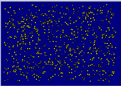
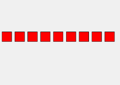

# PYTHON

## Přehled

1. [Co je Python?](#co-je-python)
2. [Vypisování](#vypisování)
3. [Proměnná](#proměnná)
8. [Kreslení](#kreslení)
9. [Podprogramy](#podprogramy)
10. [Náhoda](#náhoda)
11. [Opakování](#opakování)
12. [Větvení](#větvení)
13. [Podprogramy s parametrem](#podprogramy-s-parametrem)
14. [Listy (seznamy)](#listy-seznamy)

## Co je Python?

Python je populární programovací jazyk, který se používá napříklald pro
- vývoj webových stránek (server-side)
- vývoj softwaru
- datovou analýzu a vizualizaci
- matematické výpočty
- systémové skriptování
Proč právě Python?
- jednoduchá syntaxe
- kratší programy oproti ostatním jazykům

TODO: rozmyslet si kombinaci videí --> u vysvětlujících částí by to mohlo fungovat 

## Jupyter Notebook 
https://colab.research.google.com
https://kam.fit.cvut.cz/deploy/bi-zma/mirror/textbook/chap_slozitost.html#subsec_quic_sort

zde bude video (max minuta), které vysvětlí jak s notebooky pracovat.

## Vypisování

NAUČ SE:

Zkusme spustit první program:

```python
print(1 + 2 + 3)
```

`print()` je [funkce](#podprogramy), která se používá pro vypisování hodnot. To, co napíšeme do závorek se vypíše do konzole.

NAUČ SE:

Python lze používat jako kalkulačku (na steroidech), zvládá všechny matematické operace.

```python
print(123)
print(42 - 17)
print(3 + 4 * 5)
print((3 + 4) * 5)
print(132 / 11)
print(1 + 2 * 3 / (5 - 1))
print(2 ** 10)
```

> 2 \* 2 \* 2 \* 2 \* 2 \* 2 \* 2 \* 2 \* 2 \* 2 neboli umocnění 2 na 10 se v Pythonu zapisuje jako `2 ** 10`


### Úkol 1
VYMYSLI / NAPROGRAMUJ
Ondra měl přesně před čtyřmi měsíci 20 let. Spočítej pomocí pythonu:

1. Kolik je mu nyní přibližně dní (předpokládej, že rok má 365 dní)?
2. Kolik je to hodin?
3. Kolik je to sekund?

### Úkol 2
VYMYSLI / NAPROGRAMUJ 
Napiš program, který vypíše text: 1 + 2 * 3

NAUČ SE

Pomocí funkce `print()` lze vypsat více věcí najednou, jednotlivé části oddělíme čárkou, př.:
```
print("Dva plus dva je ", 2 + 2)
print("Do školy jsem šel", 2 * 10, "minut")
```


### Úkol 3
NAUČ SE / VYMYSLI (NAPROGRAMUJ)
Spustíš-li tento kód, vypíše se chybová hláška. Z té lze vyčíst:
- na kterém řádku programu je chyba
- o jaký typ se jedná

```python
print(10 / (6 - 2 * 3))
```
Zkus přepsat kód výše tak, aby se po jeho spuštění neobjevila chybová hláška.

ROZŠIŘUJÍCÍ KONCEPTY:
- formátovaný string: print(f"dva plus dva je {2+2}")

## Proměnná
NAUČ SE 
V matematice je zvykem označovat hodnoty písmeny, například délka strany čtverce $a = 100$ nebo poloměr kruhu $r=4$. To samé můžeš udělat i v Pythonu:

```python
moje_promenna = 100
```

Když program spustíš, nic se nestane (to je správně!). Python si vytvořil _proměnnou_ s _názvem_ `a` a přitom si zapamatoval, že tato proměnná má _hodnotu_ 100. Vypsat hodnotu, která je uložená v proměnné můžeme opět pomocí funkce `print()`, stačí do závorky napsat název proměnné, jejíž hodnotu chceme vypsat:

```python
moje_promenna = 100
print(moje_promenna)
```

Vypíše se hodnota uložená v proměnné.

### Úkol 1
VYMYSLI (NAPROGRAMUJ)
Můžeme vytvořit i více proměnných. Zkus vytvořit dvě proměnné, které pojmenuj `vyska` a `hmostnost`. Do proměnných ulož svou výšku a hmostnost. Pomocí příkazu `print()` vypiš hodnoty, které jsou v proměnných uložené.

### Úkol 2
VYMYSLI (NAPROGRAMUJ)
Proměnné můžeš použít i v matematických zápisech a Python namísto názvu proměnné dosadí její hodnotu. Vytvoř proměnné `vyska`, `hmotnost` a `bmi`. Do proměnné `bmi` ulož hodnotu BMI, kterou vypočítáš pomocí proměnných `vyska` a `hmotnost`.

### Úkol 3
VYMYSLI (NAPROGRAMUJ)

Ulož do proměnné `cena_houska` cenu za jednu housku (př. 7). Do proměnné `pocet` ulož počet housek, které chceš koupit. Pomocí těchto dvou proměnných ulož do třetí proměnné `cena_celkem` celkovou cenu za nákup. Výsledek vypiš následujícím způsobem:

```
Koupil jsem 3 x housku a zaplatil jsem 21 korun.
```
### Úkol 4
VYMYSLI (NAPROGRAMUJ)

V matematice značíme obsah kruhu $S$ a počítáme jej podle vzorce $\pi ⋅ r^2$. Obvod kruhu značíme $O$ a počítáme jej podle vzorce $2 ⋅ \pi ⋅ r$. Vytvoř proměnné pro `poloměr`, `obsah` i `obvod` kruhu a přiřaď do nich správné výrazy. Vytvoř si proměnnou `pi` s hodnotou $3.14$. Výsledek vypiš následujícím způsobem:
```
Kruh s poloměrem 4 má obvod 25.12 a obsah 50.24
```

### ÚKOL 5
DOPLŇ
Do kódu níže doplňte pomocí proměnných `a` a `b` obsah proměnných `c`, `d`, `e` a `f` tak, aby výstup vypadal takto:
```
16
8
48
3
```
```python
a = 4
b = 12
################
# TODO: Do každé proměnné níže uložte pomocí proměnných a a b nějakou hodnotu
c = None
d = None
e = None
f = None
################
# V kódu níže nic neměňte
print(c)
print(d)
print(e)
print(f)
```

### Úkol 5
DOPLŇ

Níže vidíte kód, který vykreslí červený čtverec. Před spuštěním ulož do šesti proměnných nějaké hodnoty.

```python
# Import knihovny matplotlib
import matplotlib.pyplot as plt

###########################################################
# TODO: Do každé proměnné níže uložte nějakou hodnotu
teplota_6_rano = None
teplota_9_rano = None
teplota_12_odpoledne = None
teplota_15_odpoledne = None
teplota_18_vecer = None
teplota_21_vecer = None
###########################################################

# V kódu níže nic neměňte
cas = ['6:00', '9:00', '12:00', '15:00', '18:00', '21:00']  # Časy měření
teploty = [teplota_6_rano, teplota_9_rano, teplota_12_odpoledne, teplota_15_odpoledne, teplota_18_vecer, teplota_21_vecer]  # Seznam teplot

plt.plot(cas, teploty)  # Vytvoření grafu s bodovými značkami
plt.show()  # Zobrazení grafu
```
>Graf je vykreslen pomocí knihovny matplotlib, což je populární knihovna pro vizualizaci dat v pythonu.

ÚKOL 6

Níže vidíte kód, který vykreslí křivku ve tvaru kružnice. Zkuste do proměnných `a`, `b`, `c` dosadit jiné hodnoty a odhalit, co změna každé proměnné udělá s kružnicí.
 - DÁME JIM TŘEBA LINEÁRNÍ LOMENOU FUNKCI -> NEBO IDEÁLNĚ NĚJAKÝ 3D GRAF -> ÚKOL ZNÍ, PŘIJĎTE NA TO, CO DĚLÁ S GRAFEM KTERÝ PARAMETR --> BUDOU SI HRÁT S GRAFEM A BUDOU MUSET MĚNIT HODNOTU PROMĚNNÉ A DÍVAT SE, CO TO DĚLÁ S GRAFEM -_> IDEÁLNÍ MUSÍ SAMI PŘIJÍT PODLE KOMENTÁŘŮ KTEORU PROMĚNNOU MAJÍ MĚNIT.


```python
# Import knihovny matplotlib
import matplotlib.pyplot as plt

###########################################################
# TODO: Do každé proměnné níže uložte nějakou hodnotu
teplota_6_rano = None
teplota_9_rano = None
teplota_12_odpoledne = None
teplota_15_odpoledne = None
teplota_18_vecer = None
teplota_21_vecer = None
###########################################################

# V kódu níže nic neměňte
cas = ['6:00', '9:00', '12:00', '15:00', '18:00', '21:00']  # Časy měření
teploty = [teplota_6_rano, teplota_9_rano, teplota_12_odpoledne, teplota_15_odpoledne, teplota_18_vecer, teplota_21_vecer]  # Seznam teplot

plt.plot(cas, teploty)  # Vytvoření grafu s bodovými značkami
plt.show()  # Zobrazení grafu
```


### Úkol 6
DOPLŇ

Níže vidíte kód, který vykreslí graf, který znázorňuje, jak velkou vzdálenost ujedem při konstantí rychlosti za daný čas. Před spuštěním uložte do proměnné rychlost nějakou hodnotu. Následně pomocí proměnných cas_1 až cas_6 a proměnné rychlost ulož do všech proměnných draha_1 až draha_6, jak velká vzdálenost byla ujeta.

```PYTHON
# Import knihovny matplotlib
import matplotlib.pyplot as plt

# Časy v hodinách 
cas_1 = 1/6
cas_2 = 2/6
cas_3 = 3/6
cas_4 = 4/6
cas_5 = 5/6
cas_6 = 6/6

###############################################################
# TODO 1 - doplň rychlost vozidla v km/h
rychlost = None

# TODO 2 - Výpočítej vzdálenosti pomocí proměnné rychlost a proměnných čas. 
# Dráha = rychlost * čas
draha_1 = None
draha_2 = None
draha_3 = None
draha_4 = None
draha_5 = None
draha_6 = None
################################################################

# V kódu níže nic neměňte
# Vzdálenosti v kilometrech pro každý časový okamžik
vzdalenosti = [draha_1, draha_2, draha_3, draha_4, draha_5, draha_6]
casy = [cas_1, cas_2, cas_3, cas_4, cas_5, cas_6]

plt.plot(casy, vzdalenosti)  # Vytvoření grafu s bodovými značkami
plt.show()  # Zobrazení grafu
```

ROŽIŘUJÍCÍ KONCEPTY:
- přířazení do více proměnných najednou: a, b = 1, 2
- zvýšení hodnoty: a += 1
- datové typy: a: int = 1


## Podprogramy
NAUČ SE
Doposud jsme používali jen takové příkazy, které počítač znal (`print()`). Nyní budeme vytvářet své vlastní příkazy – tzv. podprogramy.
> Podprogramům se často říká funkce či metody. Mezi funkcí a metodou jsou ale rozdíly, abychom je nemuseli řešit budeme používat obecný termín podprogram. 

Jak vytvořit podporgram

```python
def vypis_text():
    print('************')
    print('** Python **')
    print('************')
vypis_text()
```

Slovem `def` začíná definice tvého nového příkazu – podprogramu. `vypiš_text` je název podprogramu (podobně jako `print` je název pro podprogram, který vypisuje text). Tři příkazy `print` se nazývají tělo podprogramu.

Po spuštění programu se počítač naučil nový příkaz `vypis_text`. Počítač ho zatím
nevykonal, jen se ho naučil. Skupinu příkazů `print` – tedy tělo podprogramu `vypis_text` – počítač vykoná až tehdy, když narazí na příkaz `vypis_text()`. Takovýto zápis se nazývá volání podprogramu.

### Úkol 2

Přidej do programu další příkazy – pozor, tyto příkazy nesmí být odsazené (nesmí být před nimi žádná mezera, musí být hned na začátku řádku), protože už nepatří do podprogramu:

```python
def vypis_text():
    print('************')
    print('** Python **')
    print('************')

print('Vítej!')
vypis_text()
print()
vypis_text()
print('to je konec')
```

V tomto programu se nejdříve definoval podprogram `vypis_text`. Za ním následují příkazy `print` a příkazy pro volání podprogramu `vypis_text`. Python zobrazil svoji vizitku dvakrát, protože v programu jsou dvě volání podprogramu `vypis_text`. Podprogram tedy můžeme volat i vícekrát.


Vymyslete, jak tento program zkrátit
```python
print('já mám koně vraný koně')
print('to jsou koně mí')
print('já mám koně vraný koně')
print('to jsou koně mí')
print('když já jím dám ovsa')
print('oni skáčou hopsa')
print('já mám koně vraný koně')
print('to jsou koně mí')
print('já mám koně vraný koně')
print('to jsou koně mí')
```
### Úkol 3

Změň předchozí program tak, aby počítač vypsal:

```
Vítej!
*****************
** I am Python **
*****************
Jak se máš?
*****************
** I am Python **
*****************
Mám se dobře.
*****************
** I am Python **
*****************
to je konec
```

[řešení](./reseni/podprogramy/3_ukol.md)

### Úkol 4

Vytvoř nový program, který bude obsahovat následující kód:

```python
refren()
refren()
print()
print('když já jím dám ovsa')
print('oni skáčou hopsa')
print()
refren()
refren()
def refren():
    print('já mám koně vraný koně')
    print('to jsou koně mí')
```

Když program spustíš, Python vypíše chybové hlášení. Python tím říká, že na 1. řádku programu není možné volat podprogram `refren`, protože tento podprogram ještě nebyl definován. Uprav program tak, aby se úryvek písně vypsal správně.

[řešení](./reseni/podprogramy/4_ukol.md)

### Úkol 5

Ve svém programu můžeš definovat i více podprogramů. Vytvoř nový program a definuj v něm tři podprogramy. Každý z nich zobrazí jeden z následujících obrázků:

- podprogram `noha` nakreslí takovouto nohu (dole jsou dvě podtržítka vlevo i vpravo):

```
  |
__|__
```

- podprogram `obdelnik` nakreslí takovýto obdélník:

```
#####
#   #
#####
```

- podprogram `trojuhelník` nakreslí takovýto trojúhelník:

```
  *
 ***
*****
```

Potom zkus pomocí vytvořených podprogramů zobrazit následující obrázky:

```
  *
 ***
*****
  *
 ***
*****
  |
__|__
```

```
  *
 ***
*****
#####
#   #
#####
  |
__|__
```

```
#####
#   #
#####
  |
__|__
#####
#   #
#####
```

```
toto je noha:
  |
__|__

toto je obdélník:
#####
#   #
#####

toto je trojúhelník:
  *
 ***
*****
```

[řešení](./reseni/podprogramy/5_ukol.md)

ROZŠIŘUJÍCÍ KONCEPTY:
- návratová hodnota

## Náhoda

### Úkol 1

Zkus spustit následující program:

```python
import random
print(random.randint(1, 6))
```

Program vypíše náhodné číslo od 1 do 6.

### Úkol 2

Náhodné číslo si můžeš zapamatovat – napiš program s následujícím kódem a spusť jej (i vícekrát):

```python
import random
n = random.randint(1, 6)
print('Na kostce padla', n)
```

### Úkol 3

Uprav program z úkolu 2 – vytvoř podprogram `hod_kostkou`. Pomocí volání tohoto podprogramu nasimuluj pět hodů za sebou.

[řešení](./reseni/nahoda/3_ukol.md)

### Úkol 4

Uprav program z úkolu 3, aby počítač simuloval dva hody na dvacetistěnné kostce.

[řešení](./reseni/nahoda/4_ukol.md)

### Úkol 5\*

Máme _sudou_ hrací kostku, která má na stěnách čísla 2, 4, 6, 8, 10, 12. Uprav program z úkolu 3, aby simuloval hod takovou kostkou.

[řešení](./reseni/nahoda/5_ukol.md)

### Úkol 6\*

Máme _lichou_ hrací kostku, která má na stěnách čísla 1, 3, 5, 7, 9, 11. Uprav předchozí program, aby simuloval hod takovou kostkou.

[řešení](./reseni/nahoda/6_ukol.md)

### Úkol 7\*

Máme _exotickou_ hrací kostku, která má na stěnách čísla 1, 4, 9, 16, 25, 36. Uprav předchozí program, aby simuloval hod takovou kostkou.

[řešení](./reseni/nahoda/7_ukol.md)

### Úkol 8

Vytvoř program, který vygeneruje náhodný PIN pro tvůj mobil. Do čtyř proměnných `a`, `b`, `c`, `d` přiřaď náhodná čísla od 0 po 9 a potom je jediným příkazem
`print` vypiš. Výpis může vypadat například takto:

```
Tvůj nový PIN je 1 3 7 3
```
[řešení](./reseni/nahoda/8_ukol.md)

### Úkol 9

Vytvoř nový program – generátor náhodných dat (pro jednoduchost nechť má každý měsíc 30 dní). Po spuštění program vypíše informaci s vygenerovaným náhodným datem, například:

```
Pokoj si uklidím 30 . 2 . 2025
```

[řešení](./reseni/nahoda/9_ukol.md)
### Úkol 10

Vytvoř podprogram _nahodny_ctverec_, který vykreslí čtverec na náhodné pozici (souřadnice jednoho rohu budou náhodně vygenerované čísla). Čtverec bude mít stranu délky 50.

[řešení](./reseni/nahoda/10_ukol.md)
### Úkol 11

Doplň do předchozího programu příkazy tak, aby program nakreslil pět náhodných čtverců.

[řešení](./reseni/nahoda/11_ukol.md)
### Úkol 12

Uprav předchozí program tak, aby se čtverce kreslily nejen na náhodných pozicích, ale také aby měl každý čtverec náhodnou velikost z intervalu od 10 do 100.

[řešení](./reseni/nahoda/12_ukol.md)
## Opakování

### Úkol 1

Vytvoř program, který pomocí příkazu `print` vypíše text _Těším se na prázdniny_ pětkrát pod sebe.

[řešení](./reseni/opakovani/1_ukol.md)

### Úkol 2

V předchozím programu jsi měl vícekrát nakopírované příkazy `print()`. Abys je nemusel opakovaně kopírovat, můžeš to zapsat jednodušeji. Uprav kód programu z úkolu 1 následovně:

```python
for i in range(5):
    print('Těším se na prázdniny')
```

Zkus místo čísla 5 dát číslo 10 a program znovu spusť. Urči, co je tímto číslem ovlivňováno.

### Úkol 3

Uprav program stejně, jako je uvedeno níže, a spusť jej:

```python
for i in range(5):
    print('Těším se na prázdniny')
    print('=====================')
```

Slovem `for` začíná příkaz cyklu. Pětka v závorce udává počet zopakování. Dva příkazy `print` tvoří tělo cyklu (tělo známe již z podprogramů). Příkazy v těle cyklu se vykonají 5x.

### Úkol 4

Je důležité odsadit od kraje příkazy, které tvoří tělo cyklu. Vyzkoušej, co vypíše takto upravený program:

```python
for i in range(5):
    print('Těším se na prázdniny')
print('=====================')
```

### Úkol 5

Vytvoř nový program a v něm podprogram `cerveny_ctverec()`. Ten nakreslí na grafickou plochu na náhodné souřadnice červený čtverec se stranou délky 10. Použij `for` cyklus na to, abys nakreslil 2000 červených čtverců.

[řešení](./reseni/opakovani/5_ukol.md)

### Úkol 6

Doplň do předchozího programu podprogram `modry_ctverec()`. Tento podprogram bude kreslit na náhodné souřadnice modrý čtverec se stranou délky 10. Zajisti, aby tělo cyklu obsahovalo volání podprogramu `cerveny_ctverec()` i podprogramu `modry_ctverec()`. Výsledek může vypadat
například jako na následujícím obrázku:


[řešení](./reseni/opakovani/6_ukol.md)

### Úkol 7

Vytvoř nový program, který nakreslí hvězdnou
oblohu:



Návod:

- Napiš podprogram `hvezda`, který nakreslí na náhodnou pozici malý žlutý čtvereček. Velikost jeho strany bude náhodné číslo z rozsahu od 2 do 4
- Tmavomodrou oblohu nakresli jako velký obdélník s barvou _navy_
- Potom zavolej tisíckrát podprogram `hvezda`

[řešení](./reseni/opakovani/7_ukol.md)

### Úkol 8

Napiš program, který simuluje hody dvěma kostkami. Zapiš pomocí `for` cyklu pět hodů, kdy se v těle cyklu do dvou proměnných přiřadí dvě náhodná čísla, ta se vypíšou a vypíše se i jejich součet. Výpis může vypadat například takto:

```
Na první kostce padlo číslo 4
Na druhé kostce padlo číslo 3
Součet obou čísel je 7

Na první kostce padlo číslo 2
Na druhé kostce padlo číslo 4
Součet obou čísel je 6

Na první kostce padlo číslo 5
Na druhé kostce padlo číslo 2
Součet obou čísel je 7

Na první kostce padlo číslo 3
Na druhé kostce padlo číslo 1
Součet obou čísel je 4

Na první kostce padlo číslo 1
Na druhé kostce padlo číslo 4
Součet obou čísel je 5
```

[řešení](./reseni/opakovani/8_ukol.md)

### Úkol 9\*

Vytvoř nový program, který bude představovat generátor náhodného QR kódu a který bude schopen generovat podobný QR kód jako na obrázku níže:


Obrázek se skládá z velkého počtu černých čtverečků. Každý má délku strany 10 a je nakreslený v jednom náhodně vybraném políčku mřížky, která obsahuje 21x21 políček.

[řešení](./reseni/opakovani/9_ukol.md)

### Úkol 10

Vytvoř program a pomocí následujícího kódu vypiš celá čísla od 0 do 9:

```python
for i in range(10):
    print('číslo', i)
```

Jak to funguje? `i` je proměnná, do které příkaz `for` postupně přiřazuje celá čísla od 0 do 9.

### Úkol 11

Vytvoř program, který pomocí `for` cyklu vypíše čísla a jejich druhé mocniny:

```
0 na druhou je 0
1 na druhou je 1
2 na druhou je 4
3 na druhou je 9
4 na druhou je 16
5 na druhou je 25
6 na druhou je 36
```

[řešení](./reseni/opakovani/11_ukol.md)

### Úkol 12

Urči, co je potřeba v předchozím programu změnit, aby se vypsala čísla:

1. 0, 1, ... 10 – tedy i číslo 10
2. 1, 2, ... 10
3. 2, 4, ... 20
4. 10, 20, ... 100
5. 10, 9, ... 1

[řešení](./reseni/opakovani/12_ukol.md)

### Úkol 13\*

Vytvoř program a v něm pomocí cyklu nakresli devět čtverců s délkou strany 30. Mezi čtverci bude mezera o velikosti 10. Použij proměnnou `x`, ve které bude uložena x-ová souřadnice levého horního rohu kresleného čtverce. Hodnota této proměnné bude v cyklu zvýšena pokaždé o 40.



[řešení](./reseni/opakovani/13_ukol.md)

### Úkol 14

Existuje pověst o králi, který slíbil mudrcovi za odměnu tolik zrnek rýže, kolik jich bude na všech políčkách šachovnice? Král mudrcovi dovolil, aby na první políčko dal 10 zrnek, na druhé 20, na třetí 30 atd. Kolik by mudrc dostal zrnek rýže? Políček na šachovnici je 64. Druhá varianta této pověsti hovoří o tom, že král dovolil mudrci položit na každé políčko dvakrát více rýže než na předešlé políčko, kolik zrnek by dostal v tomto případě?

[řešení](./reseni/opakovani/14_ukol.md)

## Větvení

### Úkol 1

Počítač dokáže porovnávat dvě hodnoty (čísla):

```python
print(1 < 2)    # program vypíš true
print(4 < 2)    # program vypíš false

print(4 > 2 + 1)
print(1 == 1)
print(1 == 2)
print(0 != 2)
print(0 != 0)

x = 100
print(x == 10 * 10)
print(x != 10 * 10 + 1)
```

Znaménka větší/menší (`>` a `<`) známe z matematiky. Rovnost se zapisuje v pythonu jako `==` a nerovnost jako `!=`.

### Úkol 2

Vytvoříme program, který nám řekne, zda je teplo nebo zima. Do proměnné `teplota` přiřadíme číslo. Počítač pro teplotu větší než 20 stupňů vypíše, že je teplo. Jinak řekne, že je zima:

```python
teplota = 25
if teplota > 20:
    print('Dnes je teplo.')
else:
    print('Dnes je zima.')
```

`if ... else ...` je příkaz pro větvení programu. `teplota > 20` je podmínka, podle které se počítač rozhodne, kterou větev dále vykoná. `print('Dnes je teplo.')` je větev `if`. `print('Dnes je zima.')` je větev `else`.

Když počítač uvidí příkaz `if ... else ...`, nejdříve vyhodnotí podmínku. Když je podmínka splněná, vykoná se příkaz ve větvi `if`, jinak se vykoná příkaz ve větvi `else`.

Zkus měnit hodnoty v proměnné teplota tak, aby se program dostal i do větve `else`.

### Úkol 3

Uprav předchozí program tak, aby pro:

- záporné teploty vypsal _Venku je ... stupňů, vezmi si rukavice_,
- jinak vypíše _Venku je ... stupňů, rukavice nejsou potřeba_.

Ověř, že program funguje správně pro kladné i záporné hodnoty. Co tvůj program vypíše pro 0?

[řešení](./reseni/vetveni/3_ukol.md)

### Úkol 4

Vytvoř program, který určí cenu dopisu. Na začátku programu přiřaď do proměnné `hmotnost` číslo s hmotností dopisu. Použij příkaz pro větvení programu, aby pro dopis s hmotností:

- větší než 50 vypsal _Zaplatíš 55 korun_
- jinak vypíše _Zaplatíš 47 korun_

Ověř, že program počítá správně cenu dopisu pro hmotnosti: 30, 50 a 100.

[řešení](./reseni/vetveni/4_ukol.md)

### Úkol 5

Vytvoř program, ve kterém do proměnných `a`, `b` přiřaď délky stran útvaru, u nějž nevíme, zda je to obdélník nebo čtverec. Napiš kód, který určí a vypíše, zda je daný útvar obdélníkem nebo čtvercem.

[řešení](./reseni/vetveni/5_ukol.md)

### Úkol 6

Délky stran obdélníku jsou uložené v proměnných `a`, `b`. Vytvoř program, který nakreslí obdélník tak, aby vždy ležel delší stranou na zemi:


[řešení](./reseni/vetveni/6_ukol.md)

### Úkol 7

Vytvořte program, který pomocí cyklu a příkazu větvení vypíše pro:

- čísla menší než 7 _Číslo ... je menší než 7_
- ostatní čísla (až do čísla 20) _Číslo ... je větší nebo rovno 7_

[řešení](./reseni/vetveni/7_ukol.md)

### Úkol 8

Házíme desetkrát hrací kostkou a chceme vědět, kolikrát padla šestka a kolikrát jiné číslo.
Vytvoř program, který pomocí cyklu, generování náhodných čísel a příkazu větvení simuluje deset hodů kostkou, hozená čísla vypíše a spočítá, kolikrát padla šestka a kolikrát jiné číslo. Tyto počty poté vypíše. Spuštění může například vypadat takto:

```
5
6
5
2
2
3
1
4
5
3
Padlo 1 šestek a 9 jiných čísel
```

[řešení](./reseni/vetveni/8_ukol.md)

### Úkol 9\*

Hrajeme hru, ve které házíme desetkrát kostkou a získáváme prémii vždy, když za sebou
padnou dvě stejná čísla. Vytvoř program, který simuluje deset hodů kostkou, hozená čísla vypíše a spočítá počet prémií. Tento počet prémií potom vypíše. Spuštění může například vypadat takto:

```
4
4
6
5
3
3
3
1
5
5
Počet prémií: 4
```

[řešení](./reseni/vetveni/9_ukol.md)

### Úkol 10

Systém vypisuje jestli má člověk nárok na slevu podle následjících pravidel:

- když má člověk méně než 15 let, má nárok na dětskou slevu
- když má člověk více než 65 let, má nárok na seniorskou slevu
- jinak nemá nárok na slevu

V této úloze je více podmínek. Prohlédni si následující řešení:

```python
vek = 13
if vek < 15:
    print('Dětská sleva')
else:
    if vek > 65:
        print('Seniorská sleva')
    else:
        print('Není nárok na slevu')
```

Co program vypíše pro hodnoty 5, 15, 23, 89, 65, -1?

### Úkol 11

Aby byl program přehlednější, existuje v pythonu ještě příkaz `elif`:

```python
vek = 13
if vek < 15:
    print('Dětská sleva')
elif vek > 65:
    print('Seniorská sleva')
else:
    print('Není nárok na slevu')
```

Rozšiř program, aby pro lidi od 15 do 26 let vypsal _Studentská sleva_

[řešení](./reseni/vetveni/11_ukol.md)

### Úkol 12

Chceš porovnat svůj věk s věkem kamarádky. Vytvoř program, ve kterém do proměnných `ja` a `ona` přiřadíš svůj věk a věk tvé kamarádky. Program tyto údaje porovná a podle toho vypíše: _Jsme stejně staří_, _Jsem mladší_ nebo _Ona je mladší_.

[řešení](./reseni/vetveni/12_ukol.md)

### Úkol 13

Vytvoř program, ve kterém budeš kreslit na plátno
německou vlajku. Tu budeš vytvářet tak, že pomocí cyklu vygeneruješ 10 000x náhodné
souřadnice $x$, $y$. Souřadnice $x$ bude z intervalu od 10 do 350 a souřadnice $y$ bude z intervalu od 10 do 250. Na tyto souřadnice $[x, y]$ nakreslíš barevný obdélník se stranou délky 5. Barvu obdélníku zvolíš podle $y$-ové souřadnice následovně:

- když je $y$ < 90, nakreslíš černý obdélník,
- jinak, když je $y$ < 170, nakreslíš červený obdélník,
- jinak nakreslíš žlutý obdélník.

Výsledek by měl vypadat podobně jako na obrázku níže:


[řešení](./reseni/vetveni/13_ukol.md)

### Úkol 14\*

Vytvoř program, který podobnou technikou, jako byla použita v předchozí úloze, nakreslí obrázek podobný české vlajce. Výsledek může vypadat například takto:


[řešení](./reseni/vetveni/14_ukol.md)

## Podprogramy s parametrem

### Úkol 1

Vytvoř tři podprogramy. Podprogram `velkyCtverec` vykreslí čtverec s levým horním vrcholem na souřadnicích $[50, 60]$ a délkou strany 100. Podprogram `stredniCtverec` vykreslí čtverec s levým horním vrcholem na souřadnicích $[50, 60]$ a délkou strany 70. Podprogram `malyCtverec` vykreslí čtverec s levým horním vrcholem na souřadnicích $[50, 60]$ a délkou strany 40. Podprogramy poté zavolej, aby se všechny tři čtverce vykreslily do jednoho okna.

```python
import tkinter
canvas = tkinter.Canvas()
canvas.pack()

def velkyCtverec():
    canvas.create_rectangle(............, ............, ............, ............)
def stredniCtverec():
    canvas.create_rectangle(............, ............, ............, ............)
def malyCtverec():
    canvas.create_rectangle(............, ............, ............, ............)

input()
```

[řešení](./reseni/podprogramy_s_parametrem/1_ukol.md)

### Úkol 2

Předchozí řešení se dá zapsat pomocí jediného podprogramu:

```python
import tkinter
canvas = tkinter.Canvas()
canvas.pack()

def ctverec(strana):
    canvas.create_rectangle(50, 60, 50 + strana, 60 + strana)

ctverec(100)
ctverec(70)
ctverec(40)

input()
```

V závorce je název parametru `strana`. Ve funkci `create_rectangle` se parametr používá. Parametr funguje jako proměnná. Při volání podprogramu se do parametru `strana` přiřadí hodnota.

### Úkol 3

Dokonči následující podprogram `vypis`, který používá parametr `x` na to, aby vypsal hodnotu parametru `x` a jeho druhou mocninu:

```python
def vypis(x):
    print('Číslo', ...)
    print('Umocněné na druhou se rovná', ...)

vypis(1)
vypis(2)
vypis(3)
```

[řešení](./reseni/podprogramy_s_parametrem/3_ukol.md)

### Úkol 4

Doplň do předchozího podprogramu příkaz, kterým se vypíše i převrácená hodnota `x`. Připomeňme, že převrácená hodnota čísla $x$ je rovna $\frac{1}{x}$. Program by měl po spuštění vypsat:

```
Číslo 1
Umocněné na druhou se rovná 1
Převrácená hodnota se rovná 1.0
Číslo 2
Umocněné na druhou se rovná 4
Převrácená hodnota se rovná 0.5
Číslo 3
Umocněné na druhou se rovná 9
Převrácená hodnota se rovná 0.3333333333333333
```

[řešení](./reseni/podprogramy_s_parametrem/4_ukol.md)

### Úkol 5

Vytvoř program a v něm definuj podprogram `obliba`
s parametrem `cislo`. Podprogram podle následujících pravidel vypíše, zda má číslo v oblibě:

- když je číslo menší než 7, vypíše: _Mám rád číslo ..._
- jinak vypíše: _Číslo ... se mi nelíbí_

[řešení](./reseni/podprogramy_s_parametrem/5_ukol.md)

### Úkol 6

Uprav předchozí program tak, aby pomocí cyklu zavolal podprogram `obliba` pro čísla od 0 do 10. Výsledek by měl vypadat následovně:

```
Mám rád číslo 0
Mám rád číslo 1
...
Mám rád číslo 6
Číslo 7 se mi nelíbí
...
Číslo 10 se mi nelíbí
```

[řešení](./reseni/podprogramy_s_parametrem/6_ukol.md)

### Úkol 7

Vytvoř podprogram `nahodny_ctverec` s parametrem `a`, který nakreslí na náhodných souřadnicích červený čtverec se stranami délky `a`. Zavolej tento podprogram pro různé hodnoty parametru.

[řešení](./reseni/podprogramy_s_parametrem/7_ukol.md)

### Úkol 8

Vykresli pomocí podprogramu `nahodny_ctverec` z předchozího úkolu 10 čtverců. První bude mít délku strany 1, druhý stranu délky 2, třetí délku strany 3 atd.

[řešení](./reseni/podprogramy_s_parametrem/8_ukol.md)

### Úkol 9

Co se stane, když v podprogramu `nahodny_ctverec` z úkolu 7 nastavím hodnotu parametru na záporné číslo? Uprav program tak, aby vyreslil čtverec pouze pro kladné hodnoty parametru `a`. Pro záporné hodnoty vypíše do konzole zprávu _Nedá se_.

[řešení](./reseni/podprogramy_s_parametrem/9_ukol.md)

## Listy (seznamy)

### Úkol 1

Doposud jsme ukládali do proměnné pouze jednu hodnotu (číslo, text):

```python
cislo = 42
texticek = "muj ukazkovy texticek"
```

Co kdybychom ale chtěli například uložit všechna nejlepší čísla? Buď bychom museli vytvořit několik proměnných a uložit čísla postupně jedno po druhém:

```python
nejlepsi_cislo_1 = 42
nejlepsi_cislo_2 = 73
nejlepsi_cislo_3 = 420
nejlepsi_cislo_4 = 666
```

Nebo je můžeme uložit všechny najednou pomocí seznamu:

```python
nejlepsi_cisla = [42, 73, 420, 666]
```

Zkus proměnnou `nejlepsi_cisla` vypsat pomocí funkce `print()`

### Úkol 2

Zkus spustit postupně spustit oba programy níže. Jaký je rozdíl ve výpisu?

```python
for i in range(5):
    print('číslo', i)
```

```python
for i in [0, 1, 2, 3, 4]:
    print('číslo', i)
```

již víme, že příkaz `for` postupně přiřazuje do proměnné `i` hodnoty 0 až 5. Podobně lze dosazovat do proměnné `i` postupně všechny hodnoty ze seznamu. 


### Úkol 3

Doplň tělo podprogramu `vypis`. V rámci těla podprogramu se vypíšou všechny prvky v seznamu. 

```python
zvirata = ["pes", "kočka", "kůň", "opice", "krokodýl"]

def vypis(seznam):
    # vytvoř tělo podprogramu

vypis(zvirata)
    
```
[řešení](./reseni/listy/3_ukol.md)

### Úkol 4

Napište podprogram `zdvojnasob`, který dostane jako parametr seznam čísel. V rámci těla podprogramu se vypíše dvojnásobek každého čísla v seznamu.

[řešení](./reseni/listy/4_ukol.md)

### Úkol 5

Napište podprogram `eliminace`, který dostane jako parametr seznam čísel. V rámci těla podprogramu se vypíšou pouze ta čísla ze seznamu, která jsou větší než 7.

[řešení](./reseni/listy/5_ukol.md)

### Úkol 6

Napište podprogram `je_v`, který dostane dva parametry - seznam a prvek. Program vypíše "ano", pokud se daný prvek nachází v seznamu.

[řešení](./reseni/listy/6_ukol.md)

### Úkol 7

Napište podprogram `kolik_je_v`, který dostane jako parametr seznam, a který vypíše, kolik je v seznamu prvků.

[řešení](./reseni/listy/7_ukol.md)

### Úkol 8

Napište podprogram `soucet`, který dostane jako parametr seznam čísel a vypíše součet všech čísel v seznamu.

[řešení](./reseni/listy/8_ukol.md)

### Úkol 9

Zatím umíme projít celý seznam pomocí příkazu `for`. Co kdybych chtěl ale vypsat pouze jeden konkrétní prvek ze seznamu? Lze to udělat následovně:

```python
cisla = [44, 53, 92, 18]
print(cisla[2])
```

Každý prvek v seznamu má svůj index (pozici), který udává, kde se prvek v seznamu nachází. Zapisem `cisla[2]` říkáme, že chceme vybrat ze seznamu `cisla` prvek na indexu `2`. Pomocí funkce `print()` tento konkrétní prvek ze seznamu vypíšeme.

> Pozice v seznamu se číslují zleva od 0. První prvek je na pozici 0, druhý prvek na pozici 1, třetí prvek na pozici 2 atd.

Kdybych chtěl tedy vypsat první tři prvky, můžu to udělat takto:

```python
cisla = [44, 53, 92, 18]
print(cisla[0]) 
print(cisla[1])
print(cisla[2])
```


Co se stane, kdybych chtěl vypsat pátý prvek ze seznamu?


### Úkol 10

Podobně lze změnit prvek v seznamu na konkrétním indexu. Vyzkoušej, co vypíše následující program:

```python
cisla = [2, 6, 3, 4, 5]
print(cisla)

cisla[1] = 40
cisla[2] = 41
cisla[3] = 42
print(cisla)
```

zapisem `cisla[1] = 40` říkáme, že chceme změnit v seznamu `cisla` prvek na indexu `1` a nová hodnota tohoto prvku je `40`.

### Úkol 11
Vytvořte seznam o šesti prvcích, každý prvek bude číslo 0. Následně vytvořte proměnnou `hod`, do které uložte libovolné číslo od 1 do 6. Změňte prvek v seznamu na 1 podle toho, jaké číslo je uložené v proměnné `hod`. Pokud je v proměnné `hod` číslo 1, tak se první prvek (tzn. prvek na pozici 0) v seznamu přepíše na 1. Pokud je v proměnné `hod` číslo 2, tak se druhý prvek (tzn. prvek na pozici 1) v seznamu přepíše na 1 atd. Celý seznam následně vypište (mělo by v něm být pět 0 a jedna 1).
### Úkol 11

Upravte předchozí program tak, aby se do proměnné hod uložilo náhodné číslo od 1 do 6 (tzn. nenastavujte ho ručně, ale vygenerujte náhodné číslo).

<!--  [řešení](./reseni/listy/11_ukol.md) -->

### Úkol 12

Upravte předchozí kód tak, abychom hodnotu na daném indexu nenastavovali na 1, ale pouze zvýšili o jedna.

<!-- [řešení](./reseni/listy/12_ukol.md) -->

### Úkol 13

Upravte předchozí kód tak, abyste nesimulovali pouze jeden hod kostkou, ale 1000 hodů kostkou. Hodnoty postupně navyšujte. Budou výsledná čísla v seznamu přibližně stejná?

<!-- [řešení](./reseni/listy/13_ukol.md) -->

### Úkol 14

Upravte předchozí kód tak, abyste simulovali hod dvěma kostkami. Do seznam ukládejte součet na obou kostkách. Kolik prvků musí mít seznam? Prověďte 10000 hodů. Proč tentokrát nebudou všechny hodnoty v seznamu podobné?

<!-- [řešení](./reseni/listy/14_ukol.md) -->

### Úkol 15\*

Vytvořte podprogram `galtonova_deska`, který bude simulovat Galtonovu desku. Jak deska funguje znázorňuje toto [video](https://www.youtube.com/shorts/jstkPuhLDEw).

Dole je 13 přihrádek. Kuličky padají postupně přes 12 pater. V každém patře se můžou posunout buď o půl pozice doleva nebo o půl pozice doprava. Všechny kuličky začínají nad prostřední přihrádkou. Nakonec každá kulička spadne do jedné ze 13 přihrádek. Kuliček je 1000. Kolik bude nakonec v jednotlivých přihrádkách kuliček.

<!-- [řešení](./reseni/listy/15_ukol.md) -->

### Úkol 16\*

Opilec je na půli cesty mezi domovem a hospodou, každý krok udělá náhodně jedním směrem. Napište funkci, která bude simulovat opilcův pohyb. Jejími parametry budou vzdálenost mezi domovem a hospodou a počet kroků do opilcova usnutí (tj. maximální délka simulace). Simulace skončí buď tehdy, když opilec dojede domů nebo do hospody, případně po vyčerpání počtu kroků.

\*Rozšíření: Vyzkoušejte různé kombinace parametrů. Při jaké konfigurace dochází domů už celkem pravidelně?

Výpis by měl vypadat zhruba následovně:

```
home . . . . . * . . . . pub
home . . . . * . . . . . pub
home . . . * . . . . . . pub
home . . . . * . . . . . pub
home . . . * . . . . . . pub
home . . . . * . . . . . pub
home . . . * . . . . . . pub
home . . * . . . . . . . pub
home . * . . . . . . . . pub
home . . * . . . . . . . pub
home . . . * . . . . . . pub
home . . * . . . . . . . pub
home . . . * . . . . . . pub
home . . * . . . . . . . pub
home . . . * . . . . . . pub
home . . . . * . . . . . pub
home . . . . . * . . . . pub
home . . . . * . . . . . pub
home . . . . . * . . . . pub
home . . . . * . . . . . pub
home . . . . . * . . . . pub
home . . . . . . * . . . pub
home . . . . . * . . . . pub
home . . . . . . * . . . pub
home . . . . . . . * . . pub
home . . . . . . . . * . pub
home . . . . . . . . . * pub
home . . . . . . . . * . pub
home . . . . . . . . . * pub
home . . . . . . . . . . pub
Ended in the pub again!
```
<!-- [řešení](./reseni/listy/16_ukol.md) -->

### Úkol 17\*

Další simulace vhodné k programování naleznete [zde](https://www.fi.muni.cz/IB111/sbirka/04-nahodna_cisla.html#simulace-a-analyzy).

## Další úlohy

## Úkol 1

Dva hrací automaty spolu o dni volna hrály hru, v níž střídavě odebíraly mince z hromádky. 
Automat A vždy odebral jednu minci, automat B vždy odebral co nejvíce, maximálně však polovinu všech mincí, které právě byly na hromádce. 
Kdo odebral z hromádky poslední minci, vyhrál.

Automaty hrály tuto hru mnohokrát a při zahájení se pravidelně střídaly. Na začátku každé hry byl na hromádce náhodný počet mincí, nejméně 10, nejvíce 30 mincí.

Kdo z automatů vyhrával?

- častěji vyhrál B
- častěji vyhrál A
- oba vyhrávaly stejně často
- vždy vyhrál A

úloha byla převzata ze soutěže Bobřík informatiky

řešení:
Představme si konec hry. Na hromádce zbyla jedna mince. Je-li na tahu automat A, vezme ji a vyhraje. Automat B však smí vzít pouze polovinu všech mincí na hromádce, celou minci tedy vzít nesmí. Nevezme tedy nic a v následujícím tahu minci vezme automat A.

Automat A vždy vyhraje.

## Úkol 2

vězni v řadě, každý druhý umírá, kdo přežije