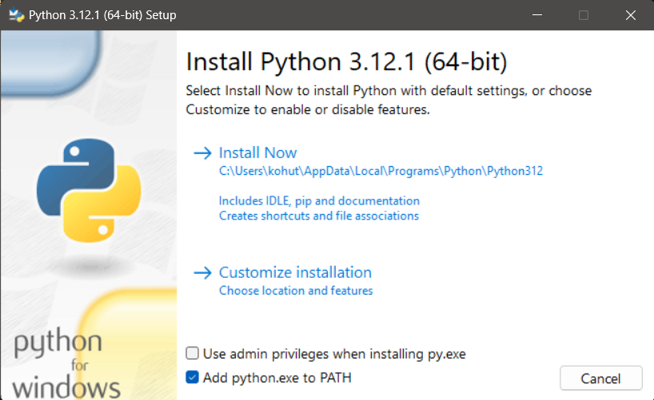
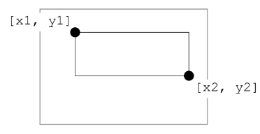

# PYTHON

## Přehled

1. [Co je Python?](#co-je-python)
2. [Instalace Pythonu](#instalace-pythonu)
3. [VS code](#vs-code)
4. [Vypisování](#vypisování)
5. [Proměnná](#proměnná)
6. [Vypisování podruhé](#vypisování-podruhé)
7. [Kreslení](#kreslení)
8. [Podprogramy](#podprogramy)
9. [Náhoda](#náhoda)
10. [Opakování](#opakování)
11. [Větvení](#větvení)
12. [Podprogramy s parametrem](#podprogramy-s-parametrem)
13. [Pole](#pole)

## Co je Python?

Python je populární programovací jazyk, který vytvořil Guido van Rossum v roce 1991.

Kde se Používá?

- vývoj webových stránek (server-side)
- vývoj softwaru
- datovou analýzu a vizualizaci
- matematické výpočty
- systémové skriptování

Proč právě Python?

- multiplatformní (Windows, Mac, Linux, Raspberry Pi atd.)
- jednoduchá syntaxe
- kratší programy oproti ostatním jazykům
- lze pracovat procedurálním způsobem, objektově orientovaným způsobem nebo funkcionálním způsobem.

## Instalace Pythonu

Abychom mohli psát programy v pythonu, je potřeba nainstalovat interpreter pro python. Instalační balíček
stáhněte [zde](https://www.python.org/downloads/) kliknutím na žluté tlačítko _Download python_. Pokud používáte jiný operační systém než windows, tak vyberte z dalších nabízených možností.

.

Následně stažený instalátor dvojklikem spusť (bude ve stažených souborech).

.

Na začátku instalace zaškrtni:

- Add python.exe to PATH
- Use admin privilegies when installing py.exe (pokud máte admin práva na počítači, pokud ne, není potřeba to řešit)

.

Poté klikněte na _Install Now_. Poté, co instalace doběhne, okno zavřete.

## VS code

Pro psaní programu budeme používat Visual Studio Code (VS code). VS code je potřeba nainstalovat do počítače z [oficiálních stránek](https://code.visualstudio.com/).

V momentě kdy máte nainstalované VS code, je potřeba nainstalovat ještě rozšíření ve VS code. V sekci `extension` vyhledejte `python` a vyberte první možnost (viz obrázek):


Nyní již můžeme vytvořit první soubor. Soubory, které obsahují programy napsané v pythonu, mají koncovku `.py`. Univerzální cesta jak vytvořit nový soubor ve VS code je v horním menu vybrat _file_ a z nabídky vybrat _new file_.


Následně se objeví vstupní pole, do kterého napište jméno vašeho souboru (třeba muj soubor) a vyberte možnost _Create New File (jmeno_souboru)_.


Otevře se klasické okno pro ukládání souboru. Do kolonky _Název souboru_ je potřeba za název souboru dopsat `.py`, což je koncovka pro soubory, které obsahují programy v pythonu.


Poté stačí uložit a můžeme začít psát první program. Program lze spustit bud pomocí `ctrl+F5` nebo tlačítkem `run python file` v pravém horním rohu.

## Vypisování

### Úloha 1

Zkusme napsat první program:

```python
print(1 + 2 + 3)
```

`print` je [funkce](#podprogramy) (funkcím se budeme věnovat později). To, co napíšeme do závorek se vypíše do konzole.

### Úloha 2

Python dokáže fungovat jako kalkulačka. Jaké budou výsledky následujících výrazů?

```python
print(123)
print(42 - 17)
print(3 + 4 * 5)
print((3 + 4) * 5)
print(132 / 11)
print(1 + 2 * 3 / (5 - 1))
```

> 2 \* 2 \* 2 \* 2 \* 2 \* 2 \* 2 \* 2 \* 2 \* 2 neboli umocnění 2 na 10 se v Pythonu zapisuje jako `2 ** 10`

### Úloha 3

Pozor, zápisy musí být správně, jinak se objeví chyba. Co se
stane, pokud zadáš následující příkazy?

```python
print(22 + 7 *)
print(19 - (3 4))
```

### Úloha 4

Někdy se však i po správném zápise může objevit chybové hlášení. Co se stane, pokud zadáš následující příkaz?

```python
print(10 / (6 - 2 * 3))
```

### Úloha 5

Petrovi bylo přesně před dvěma měsíci 16 let. Využij Python jako kalkulačku a spočítej:

1. Kolik je mu nyní přibližně dní?
2. Kolik je to hodin?
3. Kolik je to sekund?

Předpokládej, že rok má 365 dní a měsíc má 30 dní.

## Proměnná

V matematice je zvykem označovat hodnoty písmeny, například délka strany čtverce $a = 100$ nebo poloměr kruhu $r=4$. To samé můžeš udělat i v Pythonu.

### Úloha 1

Zkus napsat následující program:

```python
a = 100
```

Nic se nestalo (to je správně!). Python si vytvořil _proměnnou_ s _názvem_ `a` a přitom si zapamatoval, že má _hodnotu_ 100.

Lze si to představit jako krabičku. Text na krabičce je _název_ proměnné, zatímco to, co dáme dovnitř krabičky je _hodnota_ proměnné:


### Úloha 2

Zkusme nyní vypsat proměnnou `a`:

```python
a = 100
print(a)
```

Vypíše se hodnota uložená v proměnné.

### Úloha 3

Vyzkoušej vytvořit a nastavit i jiné proměnné:

```python
vyska = 167
cena = 22 + 7
```

Zkontroluj, jaké hodnoty se do proměnných uložily.

Proměnných můžeme vytvořit, kolik budeme chtít a později je používat v dalších výpočtech.

### Úloha 4

Definujme tři proměnné:

```python
a = 100
vyska = 167
cena = 29
```

Co se stane, když bychom chtěli vypsat proměnnou `vek`, kterou jsme zatím nedefinovali?

```python
print(vek)
```

### Úloha 5

Proměnné můžeš použít i v matematických zápisech a Python namísto názvu proměnné dosadí její hodnotu. Mějme proměnné `a`, `vyska` a `cena` ze cvičení 3. Urči výsledek následujících příkazů:

```python
print(190 - vyska)
print(3 * cena + 10)
print(cena + vyska)
```

### Úloha 6

Proměnným můžeme změnit jejich obsah – vyzkoušej:

```python
cena = 29
cena = 6 * 7
print(cena)
```

### Úloha 7

Změň hodnotu proměnné `vyska` z úlohy 4 tak, aby v ní byla tvoje výška v centimetrech.

### Úloha 8

Přiřaď do proměnné `zmrzlina` cenu jedné zmrzliny (například 25 korun). Do proměnné `pocet` přiraď počet kamarádů, kterým chceš koupit po jedné zmrzlině. Za
použití proměnných sestav přiřazovací příkaz, pomocí kterého se do třetí proměnné `zaplatit` přiřadí celková cena, kterou zaplatíš.

### Úloha 9

V matematice značíme obsah kruhu $S$ a počítáme jej podle vzorce $\pi  r^2$. Obvod kruhu značíme $O$ a počítáme jej podle vzorce $2 \pi  r$. Vytvoř proměnné pro `poloměr`, `obsah` i `obvod` kruhu a přiřaď do nich správné výrazy. Vytvoř si proměnnou `pi` s hodnotou $3.14$.

### Úloha 10

Vyzkoušej, které z následujících názvu lze použít jako název proměnné:

- kuk
- Ahoj!
- 1.A
- prvni_trida
- cerno-bile
- OK
- o0o0o0o
- asdf
- věk
- počet osob
- trida(3)

## Vypisování podruhé

### Úloha 1

Příkaz `print` již známe. Vyzkoušej, co vypíše následující program:

```python
print('Ahoj, já jsem počítač')
```

Příkaz `print` slouží na vypisování textů. Text, který se má vypsat, napíšeš mezi apostrofy.

### Úloha 2

Zjisti, co Python vypíše v případě následujících příkazů:

```python
print(1 + 2 * 3)
print('1 + 2 * 3')
print()
```

### Úloha 3

Příkaz `print` umí vypsat víc věcí – vyzkoušej následující příkazy. Co způsobí čárka v jednotlivých příkazech?

```python
print('Mám rád', 'kapustu')
print('Moje oblíbené číslo je', 42)
print('Do školy jsem šel', 2 * 10, 'minut')
```

### Úloha 4

V příkazu `print` lze kombinovat i proměnné. Zkus, co vypíše následující program:

```python
vek = 16
print('Je mi', vek, 'let')
```

### Úloha 5

Rozšiř program z úlohy 4 tak, aby navíc vypsal zprávu: _Příští rok mi bude 17 let_.

### Úloha 6

Představ si, že program z úlohy 5 spustí tvůj otec. Vyzkoušej program za něj – dosaď do proměnné věk jeho skutečný věk. Zobrazí se správný výsledek i na druhém řádku svého výstupu? Jestli ne, program oprav.

### Úloha 7

Vytvoř nový program. Na začátku přiřaď do proměnně `penize`, kolik korun máš. Do proměnné `platba` přiřaď cenu nákupu. Použij proměnné a vypiš pomocí nich:

```
Mám ... korun
Platím ... korun
Zbyde mi ... korun
```

### Úloha 8

Hřiště má šířku 50 metrů a délku 80 metrů. Budeš běhat po obvodě. Vytvoř program, který vypíše, kolik metrů uběhneš po
7 kolech. Do proměnné `sirka` přiřaď hodnotu 50, do proměnné
`delka` hodnotu 80 a do proměnné `pocet_kol` hodnotu 7. Vypiš text:

```
Šířka hřiště je 50 metrů, délka je 80 metrů
Jedno kolo okolo hřiště je 260 metrů
Po 7 kolech uběhneš 1820 metrů
```

Předpokládejme nyní, že šířka je 45 metrů a délka 70 metrů. Přepiš hodnoty v proměnných. Zobrazí program správné
hodnoty na druhém a na třetím řádku výstupu? Jestli ne, program oprav.

### Úloha 9

Obchod nabízí 20% slevu. Původní cena výrobku byla 199 korun. Napiš program, který vypočítá, kolik zaplatíš. V programu
použij proměnné `puvodni_cena`, `sleva`, `cena_po_sleve` a pomocí nich vypiš:

```
Cena alba je 199 korun
Sleva činí 20 procent
Zaplatíš 159.2 korun
```

Jakou výslednou cenu program vypíše pro výrobek, jehož původní cena byla 399 korun, jestliže sleva činí 30 %?

## Kreslení

Doposud programy počítaly a vypisovaly textové zprávy. Nyní zkusíme kreslit obrázky. Postupuj takto:

1. Vytvoř následující program:

```python
import tkinter
canvas = tkinter.Canvas()
canvas.pack()
input()
```

2. Program spusť – na obrazovce uvidíš nové okno.
3. Zjisti, zda se dá okno posouvat, měnit jeho velikost. Nakonec toto nové okno zavři. program vyrobil grafickou plochu `canvas`.

> `input()` na konci nemá s oknem nic společného. Jedná se o příkaz, který čeká, až mu uživatel do konzole napíše nějaký vstup. Kdyby tam příkaz nebyl, tak by program ihned skončil a okno by se ihned po otevření zavřelo. V následujících příkladech proto vždy nakonec programu napište `input()`, aby okno zůstalo otevřené.

### Úkol 1

Přidej do programu nový příkaz:

```python
import tkinter
canvas = tkinter.Canvas()
canvas.pack()

canvas.create_rectangle(50, 70, 220, 150)

input()
```

příkaz vykreslí obdelník.

> Příkaz `input()` musí být pořád na konci programu

### Úkol 2

V závorkách příkazu `canvas.create_rectangle( , , , )` jsou 4 čísla. Zkus je postupně měnit. Program pokaždé spusť, abys viděl, co nakreslí:

```python
canvas.create_rectangle(0, 0, 220, 150)
canvas.create_rectangle(0, 0, 50, 50)
canvas.create_rectangle(0, 0, 250, 50)
canvas.create_rectangle(20, 10, 250, 50)
canvas.create_rectangle(20, 10, 50, 250)
```

### Jak fungují souřadnice v tkinteru

Souřadnice fungují v tkinter trochu netradičně:


V matematice jsme zvyklí, že střed je "uprostřed". Zde ale leží bod se souřadnicemi $[0, 0]$ v levém horním rohu. Čísla na ose $x$ se zleva doprava. zvětšují. Čísla na ose $y$ se zvětšují shora dolů (čím větší číslo, tím níže).

V příkazu `canvas.create_rectangle(x1, y1, x2, y2)` píšeme do závorek souřadnice protilehlých vrcholů obdélníku:



Tyto souřadnice vrcholů bychom mohli znázornit na souřadnicových osách následujícím způsobem:


### Úkol 3

Nakresli obdélník, který má souřadnice
protilehlých vrcholů $[50, 30]$ a $[300, 200]$.

### Úkol 4

Nakresli obdélník, který má jeden vrchol na souřadnicích $[200, 100]$, jeho šířka je 60 a výška 140.

### Úkol 5

Nakresli dva různé čtverce se stranami délky 80 (pozici čtverců zvol podle uvážení).

### Úkol 6

Obdélník lze i vybarvit:

```python
import tkinter
canvas = tkinter.Canvas()
canvas.pack()
canvas.create_rectangle(30, 30, 130, 130, fill='red')
input()
```

### Úkol 7

Vytvoř program, který nakreslí 4 čtverce sestranou délky 50 různé barvy.

### Úkol 8

V proměnných `x`, `y` jsou uložené souřadnice levého horního rohu čtverce. Dokonči kód programu tak, abys pomocí uvedených proměnných nakreslil čtverec se stranou délky
100:

```python
import tkinter
canvas = tkinter.Canvas()
canvas.pack()
x = 100
y = 70
canvas.create_rectangle(x, y, x + , , fill='yellow')
input()
```

### Úkol 9

Vytvoř program, který použije čtyři proměnné `x`, `y`, `sirka`, `vyska` a na jejich základě nakreslí obdélník s levým horním rohem na souřadnicích `x`, `y`, danou šířkou a výškou. Barvu si zvol podle svého.

### Úkol 10

Vytvoř program, který nakreslí následující čtverce:


Tyto čtverce mají společný levý horní roh, jehož souřadnice jsou v proměnných `x`, `y`. Čtverce se postupně zmenšují tak, že červený má délku strany 100, modrý 70 a tmavomodrý 40.

## Podprogramy

Doposud jsme psali jen takové příkazy, které počítač znal (`print`, `create_rectangle`, `Canvas`). Nyní budeme vytvářet své vlastní příkazy – tzv. podprogramy (též funkce).

### Úkol 1

Jak vytvořit vlastní podprogram?

1. Opiš následující kód:

```python
def vypis_text():
    print('************')
    print('** Python **')
    print('************')
```

2. Program spusť – pokud se nic nestalo, je to v pořádku.
3. Vlož ještě příkaz `vypis_text()`:

```python
def vypis_text():
    print('************')
    print('** Python **')
    print('************')

vypis_text()
```

4. Pokud nyní program spustíš, vypíše se text.

Slovem `def` začíná definice tvého nového příkazu – podprogramu. `vypiš_text` je název podprogramu (podobně jako `print` je název pro podprogram, který vypisuje text). Tři příkazy `print` se nazývají tělo podprogramu.

Po spuštění programu se počítač naučil nový příkaz `vypis_text`. Počítač ho zatím
nevykonal, jen se ho naučil. Skupinu příkazů `print` – tedy tělo podprogramu `vypis_text` – počítač vykoná až tehdy, když narazí na příkaz `vypis_text()`. Takovýto zápis se nazývá volání podprogramu.

### Úkol 2

Přidej do programu další příkazy – pozor, tyto příkazy nesmí mít odsazení, protože už nepatří do podprogramu:

```python
def vypis_text():
    print('************')
    print('** Python **')
    print('************')

print('Vítej!')
vypis_text()
print()
vypis_text()
print('to je konec')
```

V tomto programu se nejdříve definoval podprogram `vypis_text`. Za ním následují příkazy `print` a příkazy pro volání podprogramu `vypis_text`. Python zobrazil svoji
vizitku dvakrát, protože v programu jsou dvě volání podprogramu `vypis_text`. Podprogram tedy můžeme volat i vícekrát.

### Úkol 3

Změň předchozí program tak, aby počítač vypsal:

```
Hello!
*****************
** I am Python **
*****************
How are you?
*****************
** I am Python **
*****************
I am fine.
*****************
** I am Python **
*****************
The end
```

### Úkol 4

Vytvoř nový program, který bude obsahovat následující kód:

```python
refren()
refren()
print()
print('když já jím dám ovsa')
print('oni skáčou hopsa')
print()
refren()
refren()
def refren():
    print('já mám koně vraný koně')
    print('to jsou koně mí')
```

Když program spustíš, Python vypíše chybové hlášení. Python tím říká, že na 1. řádku programu není možné volat podprogram `refren`, protože tento podprogram ještě nebyl definován. Uprav program tak, aby se úryvek písně vypsal správně.

### Úkol 5

Ve svém programu můžeš definovat i více podprogramů. Vytvoř nový program a definuj v něm tři podprogramy. Každý z nich zobrazí jeden z následujících obrázků:

- podprogram noha nakreslí takovouto nohu (dole jsou dvě podtržítka vlevo i vpravo):

```
  |
__|__
```

- podprogram obdelnik nakreslí takovýto obdélník:

```
#####
#   #
#####
```

- podprogram trojúhelník nakreslí takovýto trojúhelník:

```
  *
 ***
*****
```

Potom zkus pomocí vytvořených podprogramů zobrazit následující obrázky:

```
  *
 ***
*****
  *
 ***
*****
  |
__|__
```

```
  *
 ***
*****
#####
#   #
#####
  |
__|__
```

```
#####
#   #
#####
  |
__|__
#####
#   #
#####
```

```
toto je noha:
  |
__|__

toto je obdélník:
#####
#   #
#####

toto je trojúhelník:
  *
 ***
*****
```

### Úkol 6

Vytvoř nový program a vyzkoušej následující kód:

```python
import tkinter
canvas = tkinter.Canvas()
canvas.pack()

def kresli():
    canvas.create_rectangle(10, 20, 30, 40, fill='red')
kresli()

input()
```

### Úkol 7

Vytvoř dva podprogramy. První pojmenuj _maly_ctverec_ a druhý pojmenuj _velky_ctverec_. První podprogram vykreslí na souřadnicicích $[10, 20]$ čtverec se stranou délky 20. Druhý podprogram vykreslí čtverec na souřadnicích $[40, 40]$ se stranou délky 80. Pomocí zavolání obou programů vykreslete do jednoho plátna oba čtverce.

## Náhoda

### Úkol 1

Zkus spustit následující program:

```python
import random
print(random.randint(1, 6))
```

Program vypíše náhodné číslo od 1 do 6.

### Úkol 2

Náhodné číslo si můžeš zapamatovat – napiš program s následujícím kódem a spusť jej (i vícekrát):

```python
import random
n = random.randint(1, 6)
print('Na kostce padla', n)
```

### Úkol 3

Uprav program z úkolu 2 – vytvoř podprogram `hod_kostkou`. Pomocí volání tohoto podprogramu nasimuluj pět hodů za sebou.

### Úkol 4

Uprav program z úkolu 3, aby počítač simuloval jeden hod na dvacetistěnné kostce.

### Úkol 5\*

Máme _sudou_ hrací kostku, která má na stěnách čísla 2, 4, 6, 8, 10, 12. Uprav program z úkolu 3, aby simuloval hod takovou kostkou.

### Úkol 6\*

Máme _lichou_ hrací kostku, která má na stěnách čísla 1, 3, 5, 7, 9, 11. Uprav předchozí program, aby simuloval hod takovou kostkou.

### Úkol 7\*

Máme _exotickou_ hrací kostku, která má na stěnách čísla 1, 4, 9, 16, 25, 36. Uprav předchozí program, aby simuloval hod takovou kostkou.

### Úkol 8

Vytvoř program, který vygeneruje náhodný PIN pro tvůj mobil. Do čtyř proměnných `a`, `b`, `c`, `d` přiřaď náhodná čísla od 0 po 9 a potom je jediným příkazem
`print` vypiš. Výpis může vypadat například takto:

```
Tvůj nový PIN je 1 3 7 3
```

### Úkol 9

Vytvoř nový program – generátor náhodných dat (pro jednoduchost nechť má každý měsíc 30 dní). Po spuštění program vypíše informaci s vygenerovaným náhodným datem, například:

```
Pokoj si uklidím 30 . 2 . 2025
```

### Úkol 10

Vytvoř podprogram _nahodny_ctverec_, který vykreslí čtverec na náhodné pozici (souřadnice jednoho rohu budou náhodně vygenerované čísla). Čtverec bude mít stranu délky 50.

### Úkol 11

Doplň do předchozího programu příkazy tak, aby program nakreslil pět náhodných čtverců.

### Úkol 12

Uprav předchozí program tak, aby se čtverce kreslily nejen na náhodných pozicích, ale také aby měl každý čtverec náhodnou velikost z intervalu od 10 do 100.

## Opakování

### Úkol 1

Vytvoř program, který pomocí příkazu `print` vypíše text _Těším se na prázdniny_ pětkrát pod sebe.

### Úkol 2

V předchozím programu jsi měl vícekrát nakopírované příkazy `print()`. Abys je nemusel opakovaně kopírovat, můžeš to zapsat jednodušeji. Uprav kód programu z úkolu 1 následovně:

```python
for i in range(5):
    print('Těším se na prázdniny')
```

Zkus místo čísla 5 dát číslo 10 a program znovu spusť. Urči, co je tímto číslem ovlivňováno.

### Úkol 3

Uprav program stejně, jako je uvedeno níže, a spusť jej:

```python
for i in range(5):
    print('Těším se na prázdniny')
    print('=====================')
```

Slovem `for` začíná příkaz cyklu. Pětka v závorce udává počet zopakování. Dva příkazy `print` tvoří tělo cyklu (tělo známe již z podprogramů). Příkazy v těle cyklu se vykonají 5x.

### Úkol 4

Je důležité odsadit od kraje příkazy, které tvoří tělo cyklu. Vyzkoušej, co vypíše takto upravený program:

```python
for i in range(5):
    print('Těším se na prázdniny')
print('=====================')
```

### Úkol 5

Vytvoř nový program a v něm podprogram `cerveny_ctverec()`. Ten nakreslí na grafickou plochu na náhodné souřadnice červený čtverec se stranou délky 10. Použij `for` cyklus na to, abys nakreslil 2000 červených čtverců.

### Úkol 6

Doplň do předchozího programu podprogram `modry_ctverec()`. Tento podprogram bude kreslit na náhodné souřadnice modrý čtverec se stranou délky 10. Zajisti, aby tělo cyklu obsahovalo volání podprogramu `cerveny_ctverec()` i podprogramu `modry_ctverec()`. Výsledek může vypadat
například jako na následujícím obrázku:


### Úkol 7

Vytvoř nový program, který nakreslí hvězdnou
oblohu:


Návod:

- Napiš podprogram hvězdička, který nakreslí na náhodnou pozici malý žlutý čtvereček. Velikost jeho strany bude náhodné číslo z rozsahu od 2 do 4.
- Tmavomodrou oblohu nakresli jako velký obdélník s barvou _navy_.
- Potom zavolej tisíckrát podprogram hvezdicka.

### Úkol 8

Napiš program, který simuluje hody dvěma kostkami. Zapiš pomocí `for` cyklu pět hodů, kdy se v těle cyklu do dvou proměnných přiřadí dvě náhodná čísla, ta se vypíšou a vypíše se i jejich součet. Výpis může vypadat například takto:

```
Na první kostce padlo číslo 4
Na druhé kostce padlo číslo 3
Součet obou čísel je 7

Na první kostce padlo číslo 2
Na druhé kostce padlo číslo 4
Součet obou čísel je 6

Na první kostce padlo číslo 5
Na druhé kostce padlo číslo 2
Součet obou čísel je 7

Na první kostce padlo číslo 3
Na druhé kostce padlo číslo 1
Součet obou čísel je 4

Na první kostce padlo číslo 1
Na druhé kostce padlo číslo 4
Součet obou čísel je 5
```

### Úkol 9\*

Vytvoř nový program, který bude představovat generátor náhodného QR kódu a který bude schopen generovat podobný QR kód jako na obrázku níže:


Obrázek se skládá z velkého počtu černých čtverečků. Každý má délku strany 10 a je nakreslený v jednom náhodně vybraném políčku mřížky, která obsahuje 21x21 políček.

### Úkol 10

Vytvoř program a pomocí následujícího kódu vypiš celá čísla od 0 do 9:

```python
for i in range(10):
    print('číslo', i)
```

Jak to funguje? `i` je proměnná, do které příkaz `for` postupně přiřazuje celá čísla od 0 do 9.

### Úkol 11

Urči, co je potřeba v předchozím programu změnit, aby se vypsala čísla:

1. 0, 1, ... 10 – tedy i číslo 10
2. 1, 2, ... 10
3. 2, 4, ... 20
4. 10, 20, ... 100
5. 10, 9, ... 1

### Úkol 12

Vytvoř program, který pomocí `for` cyklu vypíše čísla a jejich druhé mocniny:

```
0 na druhou je 0
1 na druhou je 1
2 na druhou je 4
3 na druhou je 9
4 na druhou je 16
5 na druhou je 25
6 na druhou je 36
```

### Úkol 13

Vytvoř program a v něm pomocí cyklu nakresli devět čtverců
s délkou strany 30. Mezi čtverci bude mezera o velikosti 10. Použij proměnnou `x`, ve které bude uložena x-ová souřadnice levého horního rohu kresleného čtverce. Hodnota této
proměnné bude v cyklu zvýšena pokaždé o 40.


### Úkol 14

Existuje pověst o králi, který slíbil mudrcovi za odměnu tolik zrnek pšenice, kolik jich bude na všech políčkách šachovnice? Král mudrcovi dovolil, aby na první políčko dal 10 zrnek, na druhé 20, na třetí 30 atd. Kolik by mudrc dostal zrnek rýže? Políček na šachovnici je 64.

## Větvení

### Úkol 1

Počítač dokáže porovnávat dvě hodnoty (čísla):

```python
print(1 < 2)    # program vypíš true
print(4 < 2)    # program vypíš false
print(4 < 2 + 1)    # program vypíš false
print(4 - 7 < 2 + 1)    # program vypíš true
```

### Úkol 2

Vytvoříme program, který nám řekne, zda je teplo nebo zima. Do proměnné `teplota` přiřadíme číslo. Počítač pro teplotu větší než 20 stupňů vypíše, že je teplo. Jinak řekne, že je zima:

```python
teplota = 25
if teplota > 20:
    print('Dnes je teplo.')
else:
    print('Dnes je zima.')
```

`if ... else ...` je příkaz pro větvení programu. `teplota > 20` je podmínka, podle které se počítač rozhodne, kterou větev dále vykoná. `print('Dnes je teplo.')` je větev `if`. ` print('Dnes je zima.')` je větev `else`.

Když počítač uvidí příkaz `if ... else ...`, nejdříve vyhodnotí podmínku. Když je podmínka splněná, vykoná se příkaz ve větvi `if`, jinak se vykoná příkaz ve větvi `else`.

### Úkol 3

Změň předchozí program hodnotu proměnné `teplota` z 25 na 10. Program spusť. Co se vypíše?

### Úkol 4

Uprav předchzí program tak, aby pro:

- záporné teploty vypsal _Vezmi si rukavice_,
- jinak vypsal _Rukavice nejsou potřeba_.

Ověř, že program funguje správně pro kladné i záporné hodnoty. Co tvůj program vypíše pro 0?

### Úkol 5

Vytvoř program, který určí cenu dopisu. Na začátku programu přiřaď do proměnné `hmotnost` číslo s hmotností dopisu. Použij příkaz pro větvení programu, aby pro dopis s hmotností:

- větší než 50 vypsal Zaplatíš 55 korun,
- jinak vypsal Zaplatíš 47 korun.

Ověř, že program počítá správně cenu dopisu pro hmotnosti: 30, 50 a 100.

### Úkol 6

Máme krabici ve tvaru obdélníku s délkami stran, které jsou uložené v proměnných `a`, `b`. Krabici chceme položit vždy naležato. Vytvoř program, ve kterém na začátku přiřadíš do proměnných `a`, `b` rozměry krabice. Program nakreslí krabici tak, aby vždy ležela delší stranou na zemi:


### Úkol 7

Mobilní operátor počítá platby za přenesená data podle následujících pravidel:

- když za den přeneseš méně než 10 megabajtů dat, zaplatíš za každý megabajt 2 koruny,
- jinak zaplatíš za celý den 20 korun.

Napiš program, ve kterém do proměnné `megabajty` přiřadíš počet přenesených megabajtů dat za jeden den. Použij příkaz větvení na to, abys do proměnné `cena` přiřadil vyúčtovanou cenu.

### Úkol 8

Vytvoř program, který zobrazí absolutní hodnotu čísla. Do proměnné `a` přiřaď číslo. Použij příkaz větvení, abys vypsal absolutní hodnotu tohoto čísla.
Například:

- když bude a = -7, program vypíše _Absolutní hodnota -7 je 7_,
- když bude a = 13, program vypíše _Absolutní hodnota 13 je 13_.

### Úkol 9

Zatím umíš porovnávat dvě čísla pomocí `<`, `>`. Vyzkoušej, jak fungují testy rovnosti `==`
a nerovnosti `!=` . Napiš do příkazového řádku následující výrazy a zjisti, co Python vypíše:

```python
print(1 == 1)
print(1 == 2)
print(0 != 2)
print(0 != 0)

x = 100
print(x == 10 * 10)
print(x != 10 * 10)
print(11 * 11 - 21 == x)
print(1000 / 10 - 1 != x)
```

### Úkol 10

Vytvoř program. Do proměnných `a`, `b` přiřaď délky stran útvaru, u nějž nevíme, zda je to obdélník nebo čtverec. Napiš kód, který určí a vypíše, zda je daný útvar obdélníkem nebo čtvercem.

### Úkol 11

Házíme desetkrát hrací kostkou a chceme vědět, kolikrát padla šestka a kolikrát jiné číslo.
Vytvoř program, který pomocí cyklu, generování náhodných čísel a příkazu větvení simuluje deset hodů kostkou, hozená čísla vypíše a spočítá,
kolikrát padla šestka a kolikrát jiné číslo. Tyto počty poté vypíše. Spuštění může například vypadat takto:

```
5
6
5
2
2
3
1
4
5
3
Padlo 1 šestek a 9 jiných čísel
```

### Úkol 12\*

Hrajeme hru, ve které házíme desetkrát kostkou a získáváme prémii vždy, když za sebou
padnou dvě stejná čísla. Vytvoř program, který simuluje deset hodů kostkou, hozená čísla vypíše a spočítá počet prémií. Tento počet prémií potom vypíše. Spuštění může například vypadat takto:

```
4
4
6
5
3
3
3
1
5
5
Počet prémií: 4
```

### Úkol 13

Fotbaloví rozhodčí stanovili, jak budou hráče hodnotit za přestupky proti pravidlům:

- když se hráč dopustil 0 přestupků, hraje férově,
- když se dopustil 1 nebo 2 přestupků, dostane žlutou kartu,
- jinak dostane červenou kartu a je vyloučen ze hry.

Vidíš, že v této úloze je více podmínek. Prohlédni si následující řešení:

```python
pocet = 0
if pocet == 0:
    print('Hraješ férově')
else:
    if pocet < 3:
        print('Máš žlutou kartu')
    else:
        print('Máš červenou kartu')
```

Co program vypíše pro hodnoty 0, 1, 2, 3, 4, -1

### Úkol 14

Chceš porovnat svůj věk s věkem kamarádky. Vytvoř program, ve kterém do proměnných `ja` a `ona` přiřadíš svůj věk a věk tvé kamarádky. Program tyto údaje porovná a podle toho vypíše: _Jsme stejně staří_, _Jsem mladší_ nebo _Ona je mladší_.

### Úkol 15

Vytvoř program, ve kterém budeš kreslit na plátno
německou vlajku. Tu budeš vytvářet tak, že pomocí cyklu vygeneruješ 10 000x náhodné
souřadnice $x$, $y$. Souřadnice $x$ bude z intervalu od 10 do 350 a souřadnice $y$ bude z intervalu od 10 do 250. Na tyto souřadnice $[x, y]$ nakreslíš barevný obdélník se stranou délky 5. Barvu obdélníku zvolíš podle $y$-ové souřadnice následovně:

- když je $y$ < 90, nakreslíš černý obdélník,
- jinak, když je $y$ < 170, nakreslíš červený obdélník,
- jinak nakreslíš žlutý obdélník.

Výsledek by měl vypadat podobně jako na obrázku níže:


### Úkol 16

Vytvoř program, který podobnou technikou, jako byla použita v předchozí úloze, nakreslí obrázek podobný české vlajce. Výsledek může vypadat například takto:


## Podprogramy s parametrem

### Úkol 1

Dokonči jednotlivé podprogramy, aby vypisovaly věk:

```python
def jemi10():
    vek = 10
    print('Je mi', vek, 'let')
def jemi20():
    vek = ......
    print('Je mi', vek, 'let')
def jemi30():
    vek = 30
    print(...................)

jemi10()
jemi20()
jemi30()
```

Udělej to tak, aby se všechny tři podprogramy navzájem co nejvíc podobaly.

### Úkol 2

Předchozí řešení se dá zapsat pomocí jediného podprogramu:

```python
def jemi(vek):
    print('Je mi', vek, 'let')

jemi(10)
jemi(20)
jemi(30)
```

V závorce je název parametru `vek`. Ve funkci `print` se parametr používá. Parametr funguje jako proměnná. Při volání podprogramu se do parametru `vek` přiřadí hodnota.

### Úkol 3

Dokonči následující podprogram `vypis`, který používá parametr `x` na to, aby vypsal hodnotu parametru `x` a jeho druhou mocninu:

```python
def vypis(x):
    print('Číslo', ...)
    print('Umocněné na druhou se rovná', ............)

vypis(1)
vypis(2)
vypis(3)
```

### Úkol 4

Doplň do předchozího podprogramu příkaz, kterým se vypíše i převrácená hodnota `x`. Připomeňme, že převrácená hodnota čísla $x$ je rovna $\frac{1}{x}$. Program by měl po spuštění vypsat:

```
Číslo 1
Umocněné na druhou se rovná 1
Převrácená hodnota se rovná 1.0
Číslo 2
Umocněné na druhou se rovná 4
Převrácená hodnota se rovná 0.5
Číslo 3
Umocněné na druhou se rovná 9
Převrácená hodnota se rovná 0.3333333333333333
```

### Úkol 5

Dokonči podprogram `ctverec` tak, aby kreslil čtverc s levým horním vrcholem na souřadnicích $[200, 150]$ a délkou strany `a`, která bude parametrem podprogramu:

```python
import tkinter
canvas = tkinter.Canvas()
canvas.pack()
def ctverec(a):
    canvas.create_rectangle(............, ............, ............, ............)
ctverec(10)
ctverec(100)
ctverec(50)
input()
```

### Úkol 6

Vytvoř program a v něm definuj podprogram `nahodny_ctverec` s parametrem `a`, který nakreslí na náhodných souřadnicích červený čtverec se stranami délky `a`. Zavolej tento podprogram pro různé hodnoty parametru.

### Úkol 7

Vyzkoušej, co předchozí program nakreslí, když zavoláš podprogram `nahodny_ctverec` následujícím způsobem:

```python
for i in range(10):
    nahodny_ctverec(i)
```

### Úkol 8

Vytvoř program a v něm definuj podprogram `obliba`
s parametrem `cislo`. Podprogram podle následujících pravidel vypíše, zda má číslo v oblibě:

- když je číslo menší než 7, vypíše: _Mám rád číslo ..._
- jinak vypíše: _Číslo ... se mi nelíbí_

### Úkol 9

Uprav předchozí program tak, aby pomocí cyklu zavolal podprogram `obliba` pro čísla od 0 do 10. Výsledek by měl vypadat následovně:

```
Mám rád číslo 0
Mám rád číslo 1
...
Mám rád číslo 6
Číslo 7 se mi nelíbí
...
Číslo 10 se mi nelíbí
```

### Úkol 10

Vytvoř nový program a v něm definuj podprogram `ctverec` s parametrem `a`, který udává délku strany čtverce. Podprogram by měl fungovat tak, že čtverec kreslí jen pro kladné hodnoty parametru `a`, ale pro záporné hodnoty vypíše zprávu _Nedá se_. Levý horní roh kresleného čtverce bude mít souřadnice $[10, 10]$. Zprávu vypiš přibližně do středu grafické plochy.

## Pole

### Úkol 1

Vygeneruj náhodné číslo od 0 do 3. Na základě vygenerovaného čísla vykresli čtverec s levým horním rohem na souřadnicích $[50, 50]$ o délce strany 30 podle následujících pravidel:

- pro číslo 0 bude čtverec červený
- pro číslo 1 bude čtverec zelený
- pro číslo 2 bude čtverec modrý
- pro číslo 3 bude čtverec žlutý

### Úkol 2

Kdybychom podobným způsobem chtěli vykreslovat čtverce 20 různých barev, tak by se stal kód nečitelným. Lepší variantou, jak uchovávat nějaký výčet hodnot je seznam. K úloze 1 se ještě později vrátíme. Vyzkoušej, co vypíše následující program:

```python
znamky = [5, 1, 4, 3, 1, 1, 2]
print(znamky)
```

Lze si to představit jako řadu skříněk. Do každé skříňky můžeme umístit libovolný prvek.

### Úkol 3

Vyzkoušej, který z následujících seznamů můžeme v pythonu vytvořit a následně vypsat:

- [1, 2, 3, 4]
- ["jedna", "dva", "tri", "ctyri"]
- [1, "dva", 3, "ctyri"]
- [1, "dva", 1 + 2, "ctyri"]
- [1, "dva", ctyri"]
- [
  "\U0001F600",
  "\U0001F601",
  "\U0001F602",
  "\U0001F603",
  "\U0001F604",
  ]

### Úkol 4

Zkus spustit postupně spustit oba programy níže. Jaký je rozdíl ve výpisu?

```python
for i in range(5):
    print('číslo', i)
```

```python
for i in [0, 1, 2, 3, 4]:
    print('číslo', i)
```

již víme, že příkaz `for` postupně přiřazuje do proměnné `i` hodnoty 0 až 5. Podobně lze dosazovat všechny hodnoty z pole.

### Úkol 5

Napište podprogram, který dostane dva parametry - pole a prvek. Program vypíše "ano", pokud se daný prvek nachází v poli.

### Úkol 6

Napište podprogram, který dostane jako parametr pole, a který vypíše, kolik je v poli prvků.

### Úkol 7

Napište podprogram, který dostane jako parametr pole čísel a vypíše součet všech čísel v poli.

### Úkol 8

Jednotlivé prvky v poli lze měnit. Vyzkoušej, co vypíše následující program:

```python
cisla = [2, 6, 3, 4, 5]
print(cisla)

cisla[1] = 40
cisla[2] = 41
cisla[3] = 42
print(cisla)
```

zapisem `cisla[1] = 40` říkáme, že chceme změnit v seznamu `cisla` prvek na pozici `1` a nová hodnota tohoto prvku je `40`.

> Pozice v seznamu se číslují od 0. První prvek je na pozici 0, druhý prvek na pozici 1 atd.

### Úkol 9

Vytvořte seznam o šesti prvcích s hodnotou nula. Následně simulujte hod šestistěnnou kostkou tím, že vygenerujete náhodné číslo v rozmezí od 1 do 6. Podle výsledku hodu nastavte příslušný prvek v seznamu na hodnotu 1. Přitom si uvědomte, že indexy v seznamu začínají od 0, tedy číslo 1 z kostky odpovídá indexu 0 v seznamu, číslo 2 indexu 1 atd. Celý seznam následně vypište.

### Úkol 10

Upravte předchozí kód tak, abychom hodnotu na daném indexu nenastavovali, ale pouze zvyšili o jedna.

### Úkol 11

Upravte předchozí kód tak, abyste nesimulovali pouze jeden hod kostkou, ale 1000 hodů kostkou. Hodnoty postupně navyšujte. Budou výsledná čísla v seznamu přibližně stejná?

### Úkol 12

Upravte předchozí kód tak, abyste simulovali hod dvěma kostkami. Do seznam ukládejte součet na obou kostkách. Kolik prvků musí mít seznam? Prověďte 10000 hodů. Proč tentokrát nebudou všechny hodnoty v seznamu podobné?

### Úkol 13

Upravte kód z úlohy 1. Vytvořte pole, do kterého uložte čtyři názvy barev. Po vygenerování náhodného čísla uložte barvu z dané pozice v poli do proměnné.

### Úkol 14\*

Vytvořte podprogram `galtonova_deska`, který bude simulovat Galtonovu desku. Jak deska funguje znázorňuje toto [video](https://www.youtube.com/shorts/jstkPuhLDEw).

Dole je 13 přihrádek. Kuličky padají postupně přes 12 pater. V každém patře se můžou posunout buď o půl pozice doleva nebo o půl pozice doprava. Všechny kuličky začínají nad prostřední přihrádkou. Nakonec každá kulička spadne do jedné ze 13 přihrádek. Kuliček je 1000. Kolik bude nakonec v jednotlivých přihrádkách kuliček.

### Úkol 15\*

Opilec je na půli cesty mezi domovem a hospodou, každý krok udělá náhodně jedním směrem. Napište funkci, která bude simulovat opilcův pohyb. Jejími parametry budou vzdálenost mezi domovem a hospodou a počet kroků do opilcova usnutí (tj. maximální délka simulace). Simulace skončí buď tehdy, když opilec dojede domů nebo do hospody, případně po vyčerpání počtu kroků.

\*Rozšíření: Vyzkoušejte různé kombinace parametrů. Při jaké konfigurace dochází domů už celkem pravidelně?

Výpis by měl vypadat zhruba následovně:

```
home . . . . . * . . . . pub
home . . . . * . . . . . pub
home . . . * . . . . . . pub
home . . . . * . . . . . pub
home . . . * . . . . . . pub
home . . . . * . . . . . pub
home . . . * . . . . . . pub
home . . * . . . . . . . pub
home . * . . . . . . . . pub
home . . * . . . . . . . pub
home . . . * . . . . . . pub
home . . * . . . . . . . pub
home . . . * . . . . . . pub
home . . * . . . . . . . pub
home . . . * . . . . . . pub
home . . . . * . . . . . pub
home . . . . . * . . . . pub
home . . . . * . . . . . pub
home . . . . . * . . . . pub
home . . . . * . . . . . pub
home . . . . . * . . . . pub
home . . . . . . * . . . pub
home . . . . . * . . . . pub
home . . . . . . * . . . pub
home . . . . . . . * . . pub
home . . . . . . . . * . pub
home . . . . . . . . . * pub
home . . . . . . . . * . pub
home . . . . . . . . . * pub
home . . . . . . . . . . pub
Ended in the pub again!
```

### Úkol 16\*

Další simulace vhodné k programování naleznete [zde](https://www.fi.muni.cz/IB111/sbirka/04-nahodna_cisla.html#simulace-a-analyzy).
